# Base de Datos

Conceptos Basicos

- **Conceptos Basicos**

  [Conceptos básicos.pdf](assets/Conceptos_bsicos.pdf)

  - **Datos:** Son la **mínima unidad semántica**, por sí solos son irrelevantes como apoyo a la toma de decisiones.
  - **Informacion:** **Conjunto de datos procesados y que tienen un significado** (relevancia, propósito y contexto), y que por lo tanto son de utilidad para quién debe tomar decisiones, al disminuir su incertidumbre.

  

  
Base de datos (BD)

  Una base de datos es una coleccion de datos relacionados.

  > **Definicion completa:** Una base de datos es una colección o conjunto de datos interrelacionados con un propósito específico vinculado a la resolución de un problema del mundo real

  **Definir** una B. D. <strong>implica</strong> especificar los <strong>tipos de datos, estructuras y restricciones</strong> de los datos que se almacenarán en la B. D.

  **La construcción** de la B. D. es el proceso consistente en <strong>almacenar los datos en algún medio de almacenamiento controlado por el DBMS.</strong>

  **La manipulación** de una B. D. incluye funciones como la <strong>consulta</strong> de la B. D. para <strong>recuperar datos específicos</strong>, <strong>actualizar</strong> la B. D. para reflejar los cambios introducidos en el minimundo y <strong>generar informes</strong> a partir de los datos.

  **Compartir** una B. D. <strong>permite</strong> que varios usuarios y programas <strong>accedan</strong> a la B. D. en forma <strong>simultánea</strong>.
  

  

  
Caracteristicas implicitas de las bases de datos

  
  - Una B. D. representa algún aspecto del mundo real, lo que en ocasiones se denomina minimundo o universo de discurso. Los cambios introducidos en el minimundo se reflejan en ella.
  
  - Una B. D. es una colección de datos lógicamente coherente con algún tipo de significado inherente. No es correcto denominar B. D. a un surtido aleatorio de datos.
  
  - Una B. D. se diseña, construye y rellena con datos para un propósito específico. Dispone de un grupo pretendido de usuarios y algunas aplicaciones preconcebidas en las que esos usuarios están interesados.
  
  

  

  
Database management system (DBMS)

  **Objetivos**
  - Evitar redundancia e inconsistencia de datos
  - Permitir acceso a los datos en todo momento
  - Evitar anomalias en el acceso concurrente
  - Restriccion a accesos no autorizados→seguridad
  - Suministro de almacenamiento persitente de datos ante fallos
  - Integridad de los datos
  - Backups
  

  **Normalizar** los datos significa que los vamos a llevar a un esquema que **garantiza** la calidad de los datos

  Una dependencia funcional es una restriccion que se establece entre dos relaciones de base de datos

  ---
  

  
Trabajo Practico: Conceptos Basicos

  [Bases de Datos 2025 - Trabajo Práctico_ Conceptos básicos.pdf](assets/Bases_de_Datos_2025_-_Trabajo_Prctico__Conceptos_bsicos.pdf)
  1. Las principales caracteristicas que presenta la metodologia de bases de datos frente a la metodologia de procesamiento de archivos son:
      - **Naturaleza autodescriptiva de un sistema de base de datos**: Un sistema de bases de datos no solo contiene la propia base de datos, sino tambien una completa definicion de la estructura de la bases de datos y sus restricciones.
      - **Aislamiento entre programas y datos, y abstraccion de datos**: Los DBMS permiten la independencia entre programas y datos, evitando que cambios en la estructura de datos afecten a los programas. Además, las bases de datos orientadas a objetos incluyen operaciones sobre datos, facilitando la abstracción y simplificando el acceso sin conocer los detalles internos.
      - **Soporte de varias vistas de los datos**: Un DBMS multiusuario cuyos usuarios tienen variedad de diferentes aplicaciones debe ofrecer facilidades para definir varias vistas, una **vista** puede ser un subconjunto de la base de datos o puede contener datos virtuales derivados de los arDBMSchivos de la base de datos pero que no estan explicitamente almacenados
      - **Comparticion de datos y procesamiento de transacciones multiusuario**: Un DBMS multiusuario permite que varios usuarios accedan a la base de datos simultáneamente, asegurando el control de concurrencia para evitar conflictos. Los sistemas OLTP garantizan transacciones seguras y correctas. Las transacciones deben cumplir propiedades como aislamiento y atomicidad para mantener la integridad de los datos.
  2. Los actores que intervienen en el diseño, uso y mantenimiento de una Base de Datos puede depender de la estrcutura organizacional, en el caso de una base de datos pequeña un usuario normalmente define, contruye y manipula la base de datos. Sin embargo en organizaciones mas grandes los actores que inetervienen son:
      - **Administradores de las bases de datos**: la administracion de la base de datos es responsabilidad del DBA ***(database administrator).*** el DBA es responsable del acceso autorizado a la base de datos, de la coordinacion y monitorizacion de su uso, y de adquirir los recursos software y hardware necesarios.
      - **Diseñadores de las bases de datos**: Estos son los responsables de identificar los datos que se almacenaran y de elegir las estructuras apropiadas para representar y almacenar estos datos, ademas es responsabilidad de ellos comunicarse con todos los presuntos usuarios para conocer sus requisitos a fines de conseguir lograr un diseño que cumpla con sus necesidades.
      - **Usuarios finales**: Estas son las personas cuyos trabajos requiren acceso a la base de datos para realizar consultas, actualizaciones e informes
      Pregunta: Que actor interviene en el mantenimiento, es el administrador?
  3. Las diferentes ventajas de utilizar una metodologia DBMS *(database managament system),* son:
      - **Control de la redundancia:** se refiere, a la capacidad de la base de datos de no cometer errores de guardar un mismo tipo de dato con distintos datos.
      - **Restriccion del acceso no autorizado**: Es la capacidad de no permitir que cualquier persona que utiliza la base de datos, pueda acceder a la base de datos completa. Por ejemplo, los datos financieros se puede considerar confidenciales, y solo las personas autorizadas pueden acceder a ellos.
      - **Almacenamiento persistente para los objetos del programa:** La metodologia DBMS se encarga de guardar y recuperar directamente estructuras de objetos, manteniendo la compatibilidad con los lenguajes de programacion orientado a objetos.
      - **Suministro de estructuras de almacenamiento para un procesamiento eficaz de las consultas:** Esta especializado en acelerar la busqueda de datos en los discos de los registros utilizando unos archivos auxiliares utilizando indices.
      - **Copia de seguridad y recuperacion**
  4. 
  

Modelo Entidad Relacion

- **Modelo Entidad Relacion**
    
    [Modelo Entidad Relación.pdf](assets/Modelo_Entidad_Relacin.pdf)
    
    > El modelado de datos es un proceso que permite a las organizaciones descubrir, diseñar, visualizar, estandarizar e implementar activos de datos de alta calidad a través de una interfaz gráfica intuitiva.
    > 
    - Está basado en una percepción del mundo real consistente en objetos básicos, llamados entidades, y de relaciones entre estos objetos. es uno de los diferentes modelos de datos semánticos.
    - El aspecto semántico del modelo yace en la representación del significado de los datos.
    - Es extremadamente útil para hacer corresponder los significados e interacciones de las empresas del mundo real con un esquema conceptual.
    
    Hay **tres** nociones básicas que emplea el modelo de datos E-R:
    
    - Conjuntos de entidades
    - Conjuntos de relaciones
    - Atributos.
    

    
Conjunto de entidades

    

    

    
Conjunto de relaciones

    

    

    
Atributos

    - Describen propiedades que posee cada miembro de un conjunto de entidades
    - Posibles atributos del conjunto de entidades cliente son id-cliente, nombre-cliente, calle-cliente y ciudad-cliente.
    - Para cada atributo hay un conjunto de valores permitidos, llamados el dominio.
    - En ciertas ocasiones, **las relaciones también pueden tener atributos.**
    - El atributo que permite identificar unívocamente a la entidad, recibe el nombre de clave primaria. (identificar univocamente la entidad significa que esta no se puede repetir, por ejemplo para una persona seria el DNI).
    
    ### Clasificacion de atributos
    
    Los atributos pueden ser:
    
    - **Simples y compuestos:**
        - Los **simples** NO pueden subdividirse.
        - Los compuestos, en cambio, se pueden dividir en subpartes (es decir, en otros atributos). Por ejemplo, una dirección **puede** estar compuesta por los atributos calle, número y localidad
    - **Monovalorados y multivalorados:**
        - Los **monovalorados** tiene un valor sólo para una entidad; por ejemplo, el atributo número-préstamo.
        - El atributo número-teléfono para cualquier empleado puede tener cero, uno o más números de teléfono. Este tipo de atributo se llama **multivalorado**.
    - **Derivados**: El valor para este tipo de atributo se puede derivar de los valores de otros atributos o entidades relacionados. Por ejemplo, si la entidad cliente tiene el atributo fecha-nacimiento y edad, la edad deriva de la fecha de nacimiento. Si la entidad cliente tiene un atributo cantidad-préstamos, se puede derivar contando el número de entidades préstamo asociadas con ese cliente.
    

    
    ### Diagrama entidad- relación
    
    **Expresar gráficamente estructura lógica general de una base de datos.**
    
    **Consta de los siguientes componentes principales:**
    
    - **Rectángulos**, que representan entidades.
    - **Elipses**, que representan atributos **(el atributo clave se subraya).**
    - **Rombos**, que representan relaciones.
    - **Líneas**, que unen atributos a conjuntos de entidades y entidades a relaciones.
    - **Elipses dobles**, que representan atributos multivalorados.
    - **Elipses discontinuas**, que denotan atributos derivados.
    - **Líneas dobles**, que indican participación total de una entidad en una relación.
    - **Rectángulos dobles**, que representan conjuntos de entidades débiles.
    
    ### Diagrama E-R correspondiente a clientes y préstamos.
    
    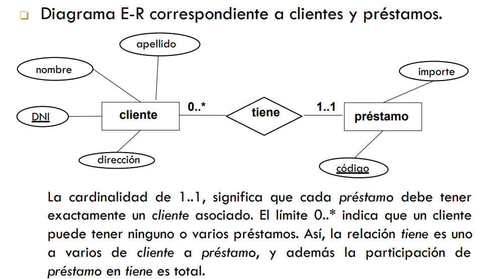
    
    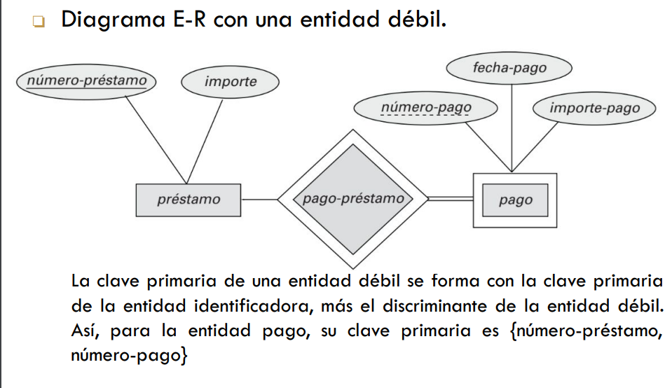
    
    Aunque los conceptos básicos de **E-R** pueden modelar la mayoría de las características de las bases de datos, algunos aspectos de una base de datos pueden ser más adecuadamente expresados mediante ciertas extensiones:
    
    - Especialización.
    - Generalización.
    - Herencia de atributos
    - Agregación.
    
    ### Especializacion y Generaclizacion
    
    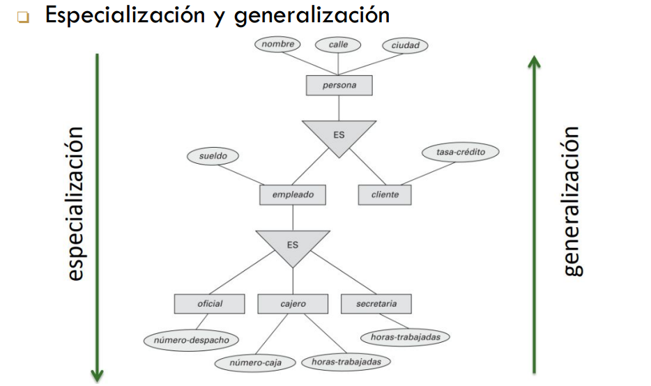
    
    Este diagrama es **Parcial y Superpuesto (Asumido por defecto)**
    
    **Cuando se usa especialización o generalización se debe definir la cobertura. Existen dos coberturas:**
    
    - **Total o parcial:** Es **total** cuando **cada entidad** de nivel más alto **debe pertenecer a una entidad de nivel más bajo**. Es parcial cuando algunas entidades de nivel más alto pueden no pertenecer a alguna entidad de nivel más bajo.
    - **Exclusiva o superpuesta**: Lo que se analiza es si un entidad del nivel más alto puede o no estar en más de una entidad de nivel más bajo. Si solo puede estar en una entidad de nivel más bajo, la cobertura es exclusiva; en tanto, si puede estar en varias, se denomina superpuesta.
    
    ### **Agregacion**
    
    Mecanismo de **abstracción** que lleva a considerar una interrelación y las entidades que participan, como una nueva entidad.
    

Modelo Relacional

- **Modelo Relacional**
    
    [Modelo Relacional.pdf](assets/Modelo_Relacional.pdf)
    
    ### Conceptos Basicos
    
    - El modelo relacional representa a una BD como una **colección de tablas**, las cuales se conforman por registros.
    - **Cada tabla se denomina relación** y está formada por filas horizontales y columnas verticales. **Cada fila representa un registro y se denomina tupla, mientras que cada columna representa un atributo del registro.**
    
    ### Selección de claves
    
    Si una entidad solo tiene un identificador, este identificador es clave primaria. Si la entidad tuviese varios identificadores, la selección de la **clave primaria (CP)** debe realizarse del siguiente modo:
    
    - Entre un identificador simple y uno compuesto, **debe tomarse el simple**.
    - Entre dos identificadores, **se debe optar por aquel de menos tamaño físico**.
    
    El resto de los identificadores será definido como **Clave Candidata (CC)**.
    
    ### Conversión de entidades
    
    - El proceso de conversión para obtener el esquema físico de una BD comienza con el análisis de las entidades definidas en el modelo lógico.
    - El proceso de conversión muestra que cada una de las entidades fuertes y débiles definidas deben transformarse en una tabla del modelo.
        
        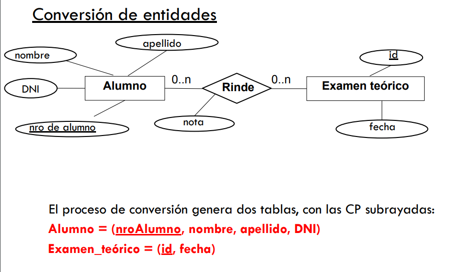
        
    
    ### **Conversión de atributos multivalorados**
    
    - Por cada atributo multivalorado (ya sea de entidad o de relación) **se crea una tabla**.
    - Se **agrega un atributo** para el multivalorado.
    - Se **agrega como atributo la clave primaria de la tabla** que modela la entidad o relación a la cual pertenece el multivalorado.
    - **La clave primaria se forma con todos sus atributos**
        
        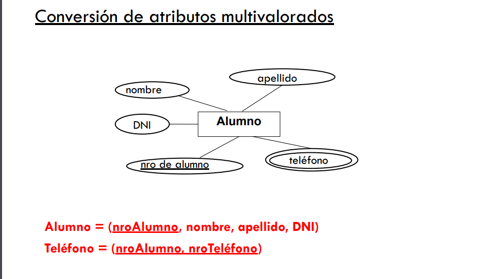
        
    
    ### Conversión de atributos compuestos
    
    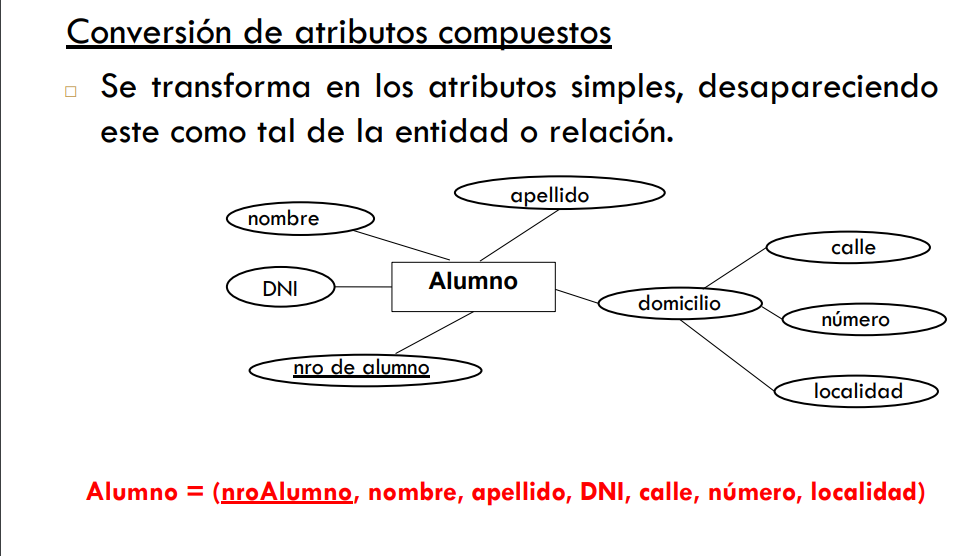
    
    ### Conversión de relaciones
    
    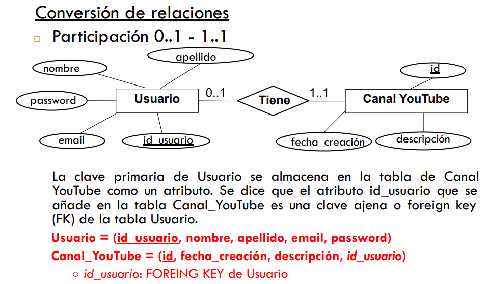
    
    No toda entidad tiene que tener un foreign key (F.K.) con otra entidad
    
    ### Conversión de relaciones
    
    1. La clave primaria de Presidente se almacena en la tabla País como un atributo y pasa a ser foreing key.
    Presidente = (DNI, nombre, apellido)
    Pais = (id, nombre, cantidad_habitantes, DNI)
    - DNI: FOREING KEY de Presidente
    2. La clave primaria de País almacena en la tabla Presidente como un atributo y pasa a ser foreing key.
    Pais = (id, nombre, cantidad_habitantes)
    Presidente = (DNI, nombre, apellido, id_país)
    - id_país: FOREING KEY de País
    3. Las claves primarias de ambas entidades se guardan en la tabla de la otra entidad. Es decir, la tabla Presidente guardaría la clave primaria de País y la tabla País guardaría también la clave primaria de Presidente. Esta solución puede presentar redundancia,
    pero puede ser interesante en algunas ocasiones, dependiendo de las consultas que se vayan a realizar sobre estas tablas a nivel de aplicación. En este caso los atributos id_país y id_presidente serían foreign key (FK).
    Presidente = (DNI, nombre, apellido, id_país)
    id_país: FOREING KEY de País
    Pais = (id, nombre, cantidad_habitantes, DNI)
    DNI: FOREING KEY de Presidente
    
    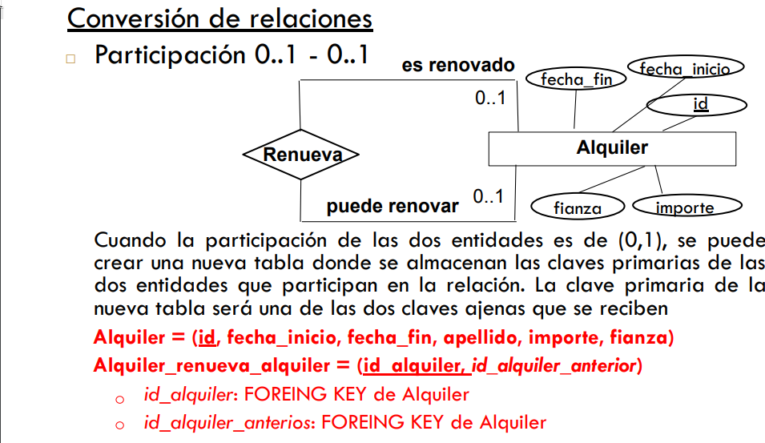
    
    ### Generalizaciones/Especializaciones
    
    Básicamente, **hay tres opciones para tratar una especialización**.
    
    1. **Eliminar las subentidades**, dejando sólo la entidad padre a la cual se le incorporan todos los atributos de sus hijos. Cada uno de ellos deberá ser no obligatorio.
        
        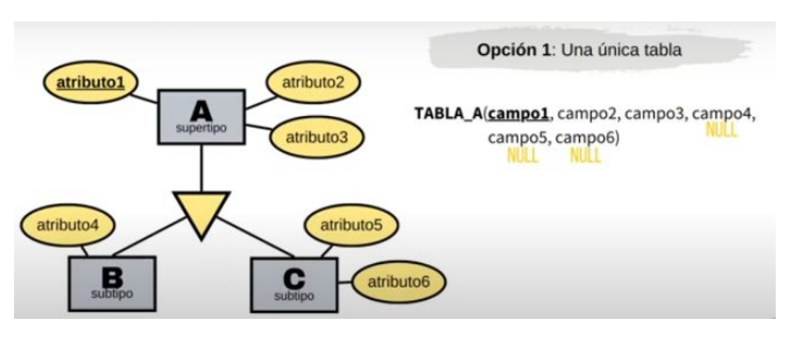
        
    2. **Eliminar la entidad padre**, dejando sólo las subentidades. Con esta solución, los atributos del padre deberán incluirse en cada uno de los hijos.
        
        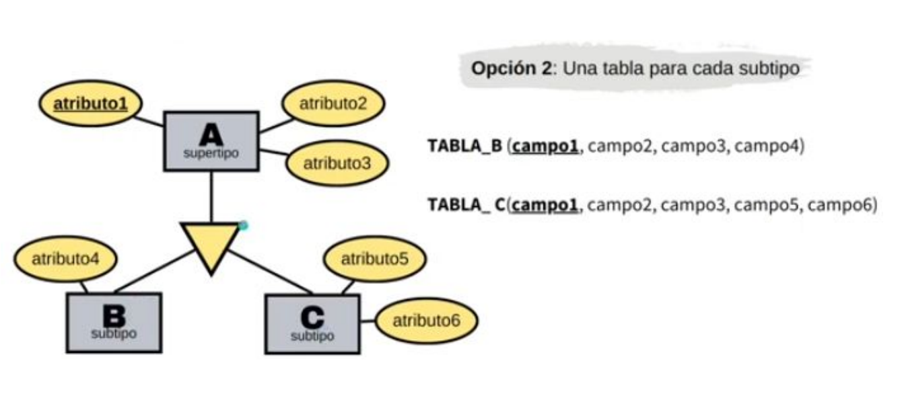
        
    3. **Dejar todas las entidades de la jerarquía**, convirtiéndolas en relaciones uno a uno entre el padre y cada uno de los hijos.
        
        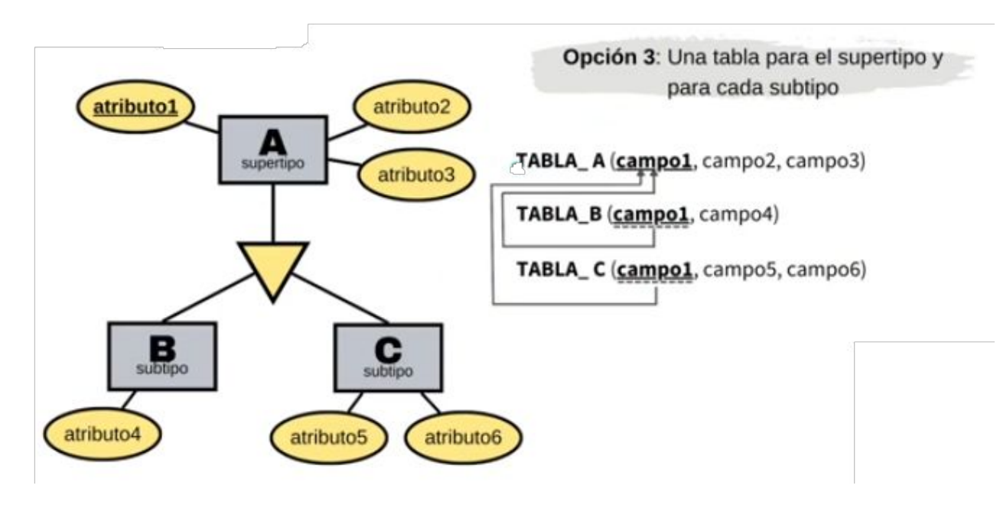
        
    
    Las tres soluciones **no** son aplicables en todos los casos.
    
    - Si la cobertura fuese parcial, la segunda solución no sería aplicable debido a que la conversión generaría un modelo no equivalente ya que se perdería información
    - La cobertura es la que determina la solución viable en cada caso.
    
    Si se analiza la cobertura superpuesta, la segunda solución no resulta práctica. Algunos elementos del padre se repiten en varios hijos, esto significa que se deberá repetir información en las subentidades generadas.
    
    Se puede afirmar que la tercera alternativa de solución es la que capta mejor la esencia de la
    herencia y, por ende, la que resulta más interesante aplicar. Sin embargo, esta solución es la que genera mayor número de entidades y relaciones en el modelo final. Esto podría significar, a futuro, problema de performance en la utilización de la B.D.
    
    ### Integridad referencial (IR)
    
    Propiedad deseable de las BD.
    
    - Asegura que un valor que aparece para un atributo en una tabla, aparezca además en otra tabla para el mismo atributo.
    - Plantea restricciones entre tablas y sirve para mantener la consistencia entre las tuplas de dichas tablas.
    - Ejemplo:
    Facturas = (nroFactura, fecha, monto, nroCliente (CF))
    Clientes = (nroCliente, nombre, dirección)
        - En la tabla Facturas, nroCliente es una CF. Esta CF permite establecer IR entre las tablas Facturas y Clientes. Notar que nroCliente es CP en Clientes.
    
    **Resumen de conversion con Multiplicidades**
    
    0..n → 1..1 Se guarda la cp de la entidad de 0..n en la tabla 1..1
    
    1..1 → 1..1 Se guarda la cp en la entidad que prefiera, pero siempre se guarda en alguna
    
    0..n → 0..n Se guarda la relacion con ambas claves primarias
    

Normalizacion

- **Normalizacion**
    
    [Normalizacion.pdf](assets/Normalizacion.pdf)
    
    ### Dependencias funcionales
    
    Una **dependencia funcional** es una **restricción** que se establece entre dos conjuntos de atributos de una tabla de la Base de Datos. 
    
    Una **dependencia funcional** es una **propiedad de la semántica** o significado de los atributos. Los diseñadores de la B. D. utilizarán su comprensión de la semántica de los atributos de R (esto es, cómo se relacionan unos con otros) para especificar las dependencias funcionales que deben mantenerse en todos los estados de relación r de R.
    
    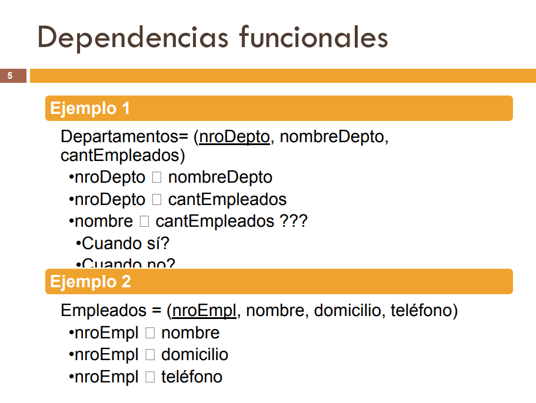
    
    
    
    ### Dependencia funcional transitiva
    
    ## Normalización
    
    > Técnica de diseño de BD que comienza examinando las relaciones que existen entre los atributos (dependencias funcionales). La normalización identifica el agrupamiento óptimo de estos atributos, con el fin de identificar un conjunto de relaciones que soporten adecuadamente los requisitos de datos de la organización.
    > 
    
    El **proposito** es producir un conjunto de relaciones (tablas) con una serie de propiedades deseables partiendo de los requisitos de datos de una organización.
    
    La **normalización** es un mecanismo que permite que un conjunto de tablas, que integran una BD, **cumpla** una serie de propiedades deseables. Estas **propiedades** consisten en evitar:
    
    - Redundancia de datos. → Evitar redundancia de datos no claves
    - Anomalías de actualización.
    - Pérdida de integridad de datos.
        
        [BASE DE DATOS 24-4.pdf](assets/BASE_DE_DATOS_24-4.pdf)
        

Algebra Relacional

- **Algebra Relacional**
    
    [Álgebra Relacional_modif_11-4.pdf](assets/lgebra_Relacional_modif_11-4.pdf)
    
    - Un modelo de datos debe incluir un conjunto de operaciones para manipular la base de datos junto con los conceptos necesarios para la definición de su estructura y restricciones.
    - El conjunto de operaciones básicas del modelo relacional es el **álgebra relacional**, el cual permite al usuario especificar las peticiones fundamentales de recuperación.
    - El resultado de una recuperación es una nueva relación, la cual puede estar constituida por una o más relaciones.
    

    
Razones por las que es importante el algebra relacional

    - El álgebra relacional es muy importante por varias razones. La primera, porque **proporciona** un **fundamento formal para las operaciones del modelo formal**.
    - La segunda razón, es que se utiliza como base para la implementación y optimización de consultas en los RDBMS (Sistemas de administración de bases de datos relacionales). Tercera, porque algunos de sus conceptos se han incorporado al lenguaje estándar de consultas SQL para los RDBMS.
    

    
    ### Tipos de Operadores Básicos
    
    **Unarios: Operan sobre una sola relación:**
    

    
Selección ($σ$)

    - Se emplea para seleccionar un subconjunto de las tuplas que satisfacen un predicado.
    - Se puede considerar esta operación como un filtro que mantiene sólo las tuplas que satisfacen una determinada condición.
    
    **Filtra filas (tuplas) que cumplen una condición.**
    
    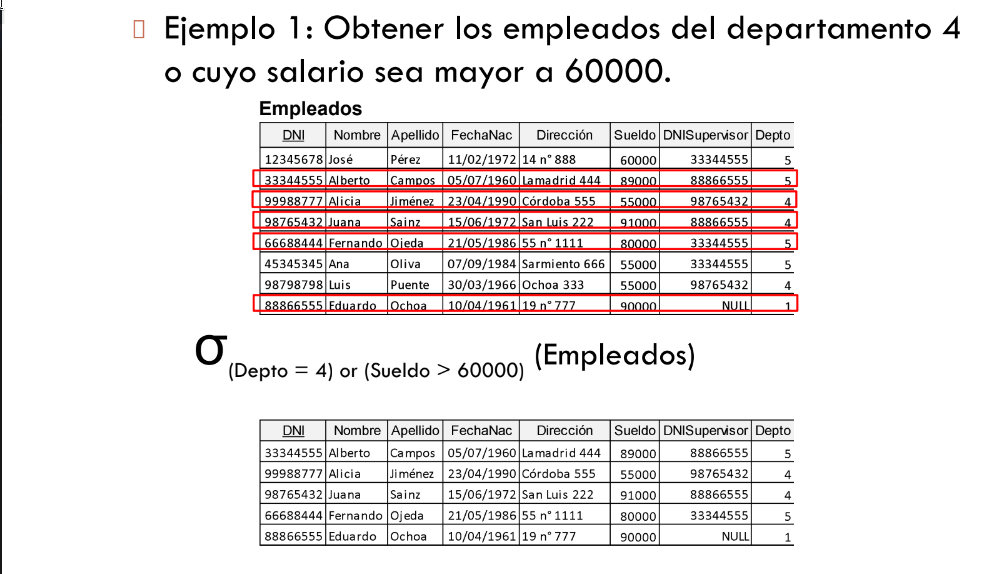
    

    

    
Proyección ($π$)

    - Permite presentar los atributos especificados de una relación y no presentar el resto.
    - Esta operación selecciona ciertas columnas de la tabla y descarta otras.
    
    Va a ser 0 si la tabla original es vacia, sino un elemento al menos va tener
    
    **Elige columnas específicas.**
    
    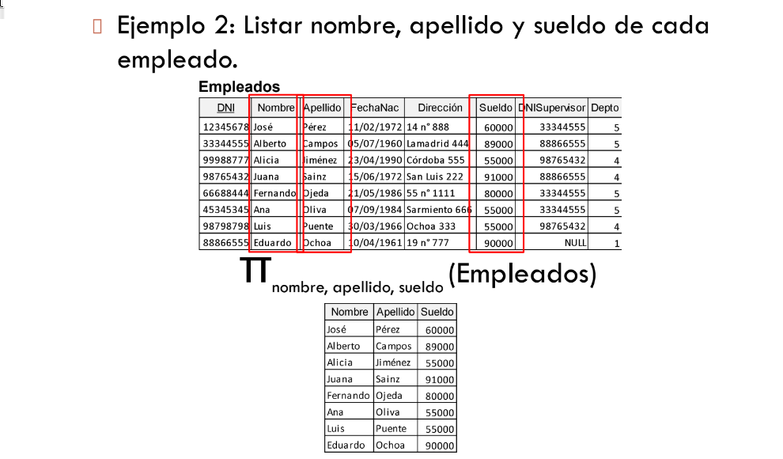
    
    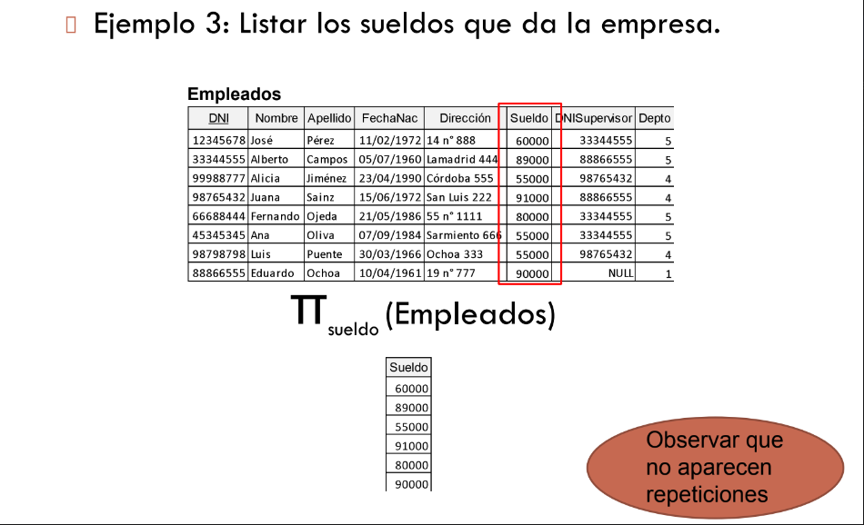
    

    

    
Renombre ($ρ$)

    - Define un alias para una relación.
    - Útil para evitar ambigüedades cuando una relación aparece más de una vez en una consulta.
    - Esta operación aplicada a una relación R de grado n aparece denotada de cualquiera de estas tres formas:
        
        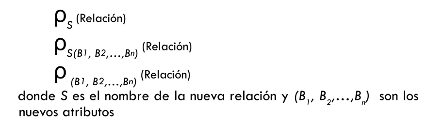
        
        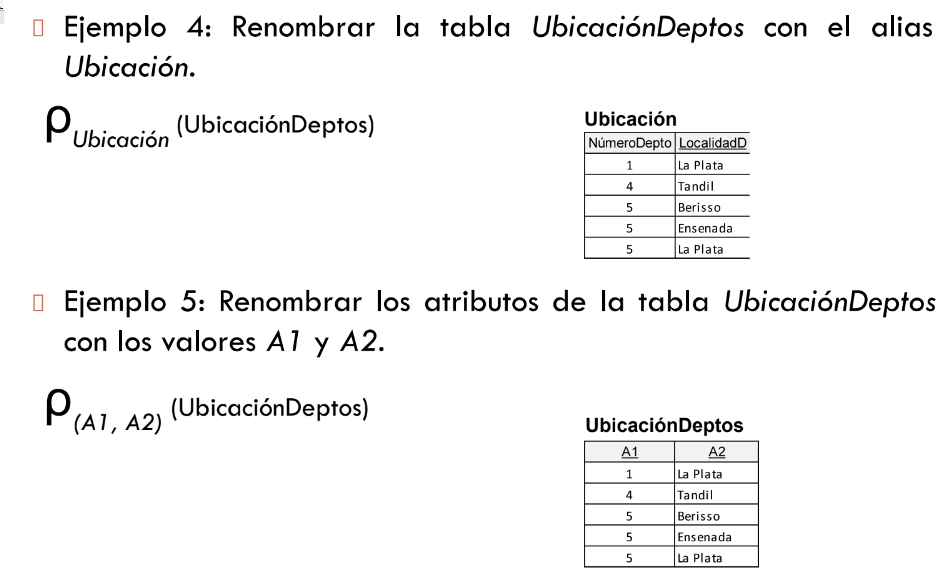
        
        **Combina dos relaciones con el mismo esquema (atributos).**
        
    

    
    **Binarios: operan sobre dos relaciones:**
    

    
Producto cartesiano ($x$)

    - El producto cartesiano es una operación que, a partir de dos relaciones vincula cada tupla de una de las relaciones con cada tupla de la otra relación.
    - La operación aplicada es, por sí misma, absurda. Es útil cuando va seguida por una selección que correlaciones los valores de los atributos procedentes de las relaciones componentes.
    - Número de columnas de $R x S$ = Cols. de R + Cols. de S
    - Número de tuplas de $R x S$ = Tuplas de R * Tuplas de S
    - Para evitar ambigüedades: Usar sintaxis tabla.columna
        
        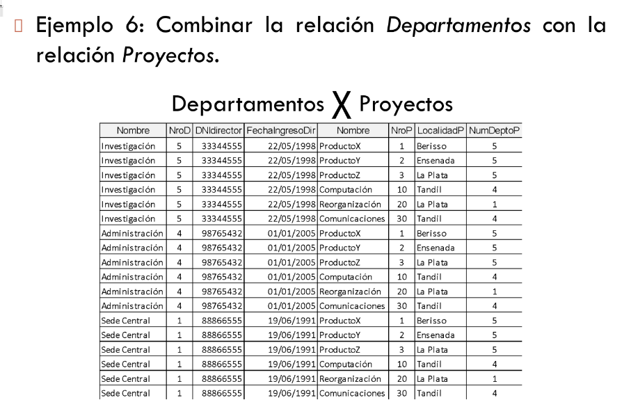
        
    

    

    
Unión (U)

    - Equivale a la unión matemática de conjuntos.
    - Las tuplas repetidas son eliminadas.
    - Las relaciones a unir deben ser **compatibles** (Igual número de atributos
    Dominios iguales dos a dos)
    
    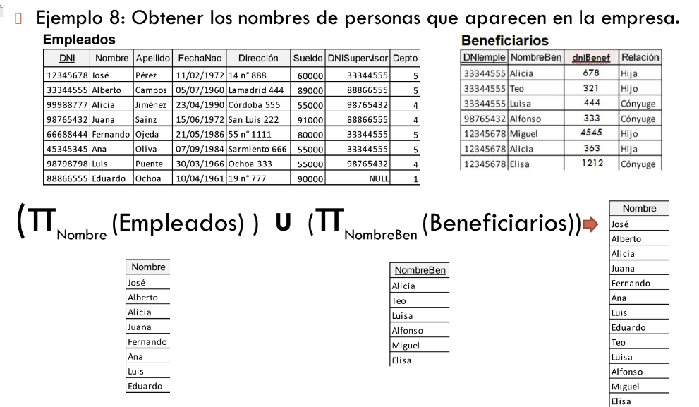
    

    

    
Diferencia (-)

    - Equivale a la diferencia matemática de conjuntos.
    - Incluye tuplas que están en una relación pero no en la otra.
    

    
    ### Operaciones adicionales.
    

    
Producto natural (⨝)

    - Combina los elementos de la primera relación que se relacionan con los elementos de la segunda relación.
    - Simplifica consultas que combinan varias relaciones.
    - Es una reunión con el operador de igualdad para combinar los atributos comunes de las relaciones.
    - No especifica explícitamente el predicado de combinación y la selección se hace en base a los campos comunes.
    
    *(Es lo mismo que realizar una operación de selección posterior a un
    producto cartesiano.)*
    
    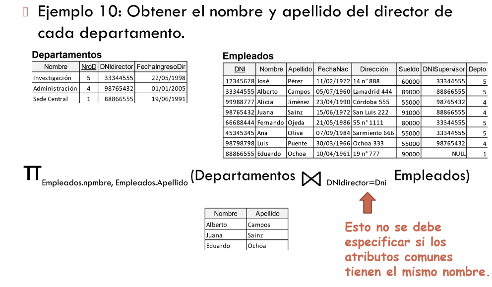
    

    

    
Intersección ($∩$)

    - Equivale a la intersección matemática de conjuntos.
    - Incluye tuplas que están en todas las relaciones.
    - Incluye las tuplas que están en $R$ y en $S$.
        
        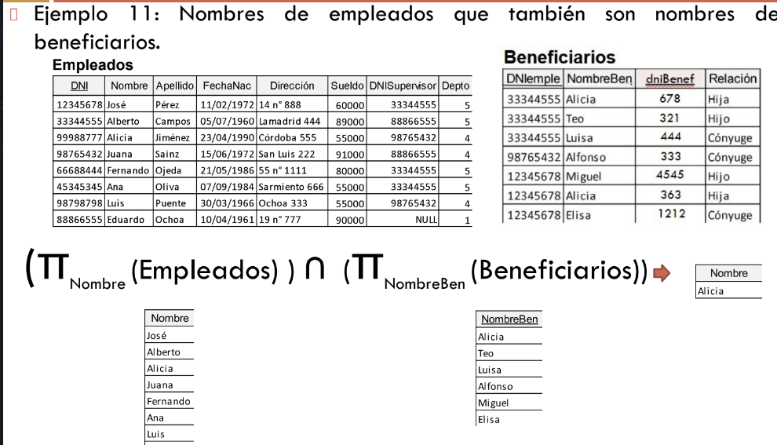
        
    

    

    
Asignación (🡨)

    - Crea una nueva relación a partir de otra.
    - Lo que se asigna puede ser una relación existente o el resultado de una operación.
    
    > Nueva 🡨 Expresión de AR
    > 
    

    

    
División (”/”)

    - Retorna aquellos elementos de la primera relación que se relacionan con todos los elementos de la segunda relación.
    - $A/B$ retorna los elementos de A que se relacionan con todos los elementos de B, donde las columnas de B deben estar incluidas en las columnas de A.
    
    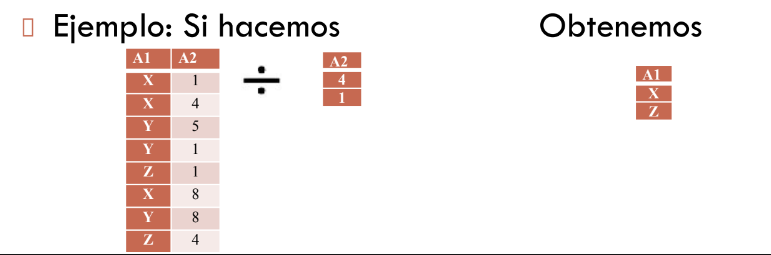
    
    

    

    
Ejercicios

    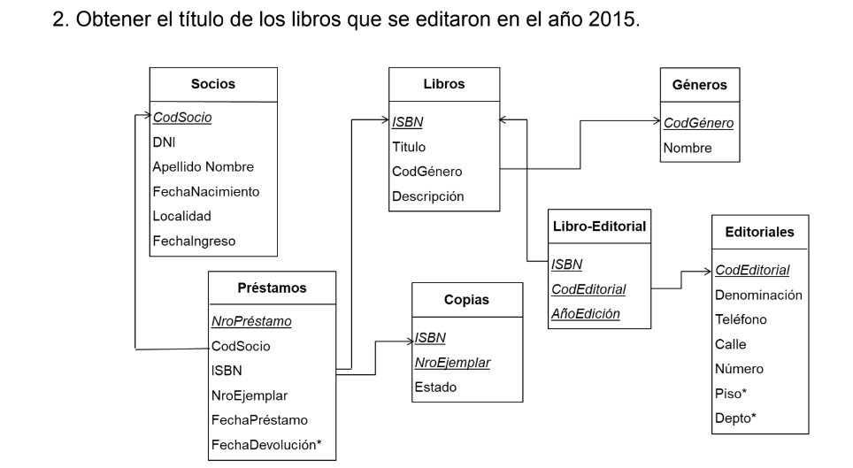
    
    **$σ_{Libros.añoEdicion=2015}$**($π_{Libro-Edicion.AñoEdicion, Libros.titulo}$(Libro-Editorial $X$ Libros))
    
    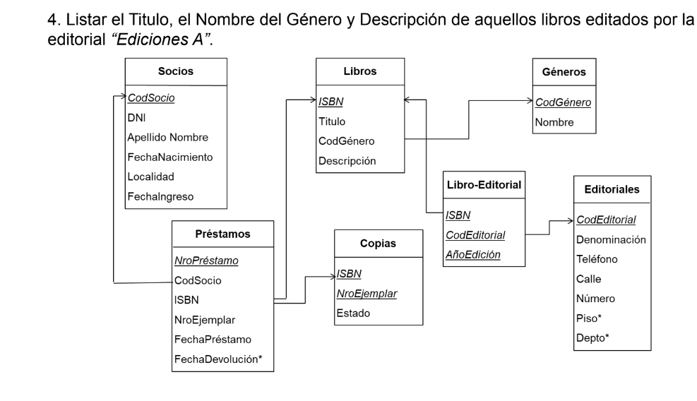
    
    ($σ_{Editoriales.Denominacion = "Ediciones A"}$)
    
    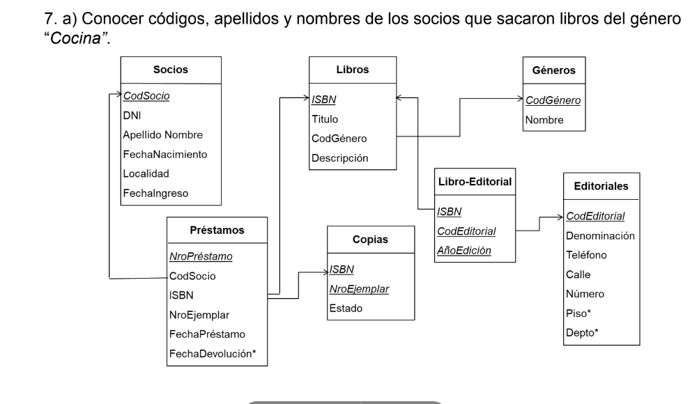
    
    $σ_{codigo, apellido, nombre}$(Socios)
    
    

Transacciones

- **Transacciones**
    
    [Transacciones.pdf](assets/Transacciones.pdf)
    
    

    
Transacciones (Conceptos - Estados de ejecución - Planificiones)

    ...
    

    

    
Transacciones (Control de concurrencia - Bloqueos - Protocolos - Granularidad - Interbloqueos)

    ...
    

    

    
Transacciones (Técnicas de recuperación de Bases de Datos)

    ...
    

SQL (Structured Query Language)

- **SQL (Structured Query Language)**
    
    [Tips Sobre SQL.pdf](assets/Tips_Sobre_SQL.pdf)
    
    [ClaseSQLC31.sql](assets/ClaseSQLC31.sql)
    
    - **Guia de comandos**
        
        .png)
        

---

- **Trabajos Practicos**
    

    
Tp1 (Modelo Entidad Relacion)

    ...
    

    

    
Tp2 (Modelo Relacional)

    ...
    

    

    
Tp3 (Algebra Relacional)

    ...
    

    

    
TP4 (Normalizacion)

    ...
    

    

    
Tp5 (Transacciones)

    ...
    

    

    
TP's SQL

    ...
    

**Link Drive**: [https://drive.google.com/drive/folders/1aDWIgEzHrZhI3O9pzaD10qo-A6jFnpe3](https://drive.google.com/drive/folders/1aDWIgEzHrZhI3O9pzaD10qo-A6jFnpe3)

**Para practicar SQL:** [https://datalemur.com/](https://datalemur.com/)
