# Base de Datos

- **Conceptos Basicos**
    
    [Conceptos básicos.pdf](assets/Conceptos_bsicos.pdf)
    
    - Datos: Son la **mínima unidad semántica**, por sí solos son irrelevantes
    como apoyo a la toma de decisiones.
    - Informacion:  **Conjunto de datos procesados y que tienen un significado** (relevancia, propósito y contexto), y que por lo tanto son de utilidad para quién debe tomar decisiones, al disminuir su incertidumbre.
    - **Base de datos (BD)**
        
        Una base de datos es una coleccion de datos relacionados.
        
        > **Definicion completa**: Una base de datos es una colección o conjunto de datos interrelacionados con un propósito específico vinculado a la resolución de un problema del mundo real
        > 
        
        **Definir** una B. D. **implica** especificar los **tipos de datos, estructuras y restricciones** de los datos que se almacenarán en la B. D.
        
        La **construcción** de la B. D. es el proceso consistente en **almacenar los datos en algún medio de almacenamiento controlado por el DBMS.**
        
        La **manipulación** de una B. D. incluye funciones como la **consulta** de la B. D. para **recuperar datos específicos**, **actualizar** la B. D. para reflejar los cambios introducidos en el minimundo y **generar informes** a partir de los datos.
        
        **Compartir** una B. D. **permite** que varios usuarios y programas **accedan** a la B. D. en forma **simultánea**.
        
    - **Caracteristicas implicitas de las bases de datos**
        - Una B. D. representa algún aspecto del mundo real, lo que en ocasiones se denomina minimundo o universo de discurso. Los cambios introducidos en el minimundo se reflejan en ella.
        - Una B. D. es una colección de datos lógicamente coherente con algún tipo de significado inherente. No es correcto denominar B. D. a un surtido aleatorio de datos.
        - Una B. D. se diseña, construye y rellena con datos para un propósito específico. Dispone de un grupo pretendido de usuarios y algunas aplicaciones preconcebidas en las que esos usuarios están interesados.
    - **Database management system (DBMS)**
        
        **Objetivos**
        
        - Evitar redundancia e inconsistencia de datos
        - Permitir acceso a los datos en todo momento
        - Evitar anomalias en el acceso concurrente
        - Restriccion a accesos no autorizados→seguridad
        - Suministro de almacenamiento persitente de datos ante fallos
        - Integridad de los datos
        - Backups
    
    **Normalizar** los datos significa que los vamos a llevar a un esquema que **garantiza** la calidad de los datos
    
    Una dependencia funcional es una restriccion que se establece entre dos relaciones de base de datos
    
    ---
    
    - **Trabajo Practico: Conceptos Basicos**
        
        [Bases de Datos 2025 - Trabajo Práctico_ Conceptos básicos.pdf](assets/Bases_de_Datos_2025_-_Trabajo_Prctico__Conceptos_bsicos.pdf)
        
        1. Las principales caracteristicas que presenta la metodologia de bases de datos frente a la metodologia de procesamiento de archivos son:
            - **Naturaleza autodescriptiva de un sistema de base de datos**: Un sistema de bases de datos no solo contiene la propia base de datos, sino tambien una completa definicion de la estructura de la bases de datos y sus restricciones.
            - **Aislamiento entre programas y datos, y abstraccion de datos**: Los DBMS permiten la independencia entre programas y datos, evitando que cambios en la estructura de datos afecten a los programas. Además, las bases de datos orientadas a objetos incluyen operaciones sobre datos, facilitando la abstracción y simplificando el acceso sin conocer los detalles internos.
            - **Soporte de varias vistas de los datos**: Un DBMS multiusuario cuyos usuarios tienen variedad de diferentes aplicaciones debe ofrecer facilidades para definir varias vistas, una **vista** puede ser un subconjunto de la base de datos o puede contener datos virtuales derivados de los arDBMSchivos de la base de datos pero que no estan explicitamente almacenados
            - **Comparticion de datos y procesamiento de transacciones multiusuario**: Un DBMS multiusuario permite que varios usuarios accedan a la base de datos simultáneamente, asegurando el control de concurrencia para evitar conflictos. Los sistemas OLTP garantizan transacciones seguras y correctas. Las transacciones deben cumplir propiedades como aislamiento y atomicidad para mantener la integridad de los datos.
        2. Los actores que intervienen en el diseño, uso y mantenimiento de una Base de Datos puede depender de la estrcutura organizacional, en el caso de una base de datos pequeña un usuario normalmente define, contruye y manipula la base de datos. Sin embargo en organizaciones mas grandes los actores que inetervienen son:
            - **Administradores de las bases de datos**: la administracion de la base de datos es responsabilidad del DBA ***(database administrator).*** el DBA es responsable del acceso autorizado a la base de datos, de la coordinacion y monitorizacion de su uso, y de adquirir los recursos software y hardware necesarios.
            - **Diseñadores de las bases de datos**: Estos son los responsables de identificar los datos que se almacenaran y de elegir las estructuras apropiadas para representar y almacenar estos datos, ademas es responsabilidad de ellos comunicarse con todos los presuntos usuarios para conocer sus requisitos a fines de conseguir lograr un diseño que cumpla con sus necesidades.
            - **Usuarios finales**: Estas son las personas cuyos trabajos requiren acceso a la base de datos para realizar consultas, actualizaciones e informes
            
            Pregunta: Que actor interviene en el mantenimiento, es el administrador?
            
        3. Las diferentes ventajas de utilizar una metodologia DBMS *(database managament system),* son:
            - **Control de la redundancia:** se refiere, a la capacidad de la base de datos de no cometer errores de guardar un mismo tipo de dato con distintos datos.
            - **Restriccion del acceso no autorizado**: Es la capacidad de no permitir que cualquier persona que utiliza la base de datos, pueda acceder a la base de datos completa. Por ejemplo, los datos financieros se puede considerar confidenciales, y solo las personas autorizadas pueden acceder a ellos.
            - **Almacenamiento persistente para los objetos del programa:** La metodologia DBMS se encarga de guardar y recuperar directamente estructuras de objetos, manteniendo la compatibilidad con los lenguajes de programacion orientado a objetos.
            - **Suministro de estructuras de almacenamiento para un procesamiento eficaz de las consultas:** Esta especializado en acelerar la busqueda de datos en los discos de los registros utilizando unos archivos auxiliares utilizando indices.
            - **Copia de seguridad y recuperacion**
        4. 
    
- **Modelo Entidad Relacion**
    
    [Modelo Entidad Relación.pdf](assets/Modelo_Entidad_Relacin.pdf)
    
    > El modelado de datos es un proceso que permite a las organizaciones descubrir, diseñar, visualizar, estandarizar e implementar activos de datos de alta calidad a través de una interfaz gráfica intuitiva.
    > 
    - Está basado en una percepción del mundo real consistente en objetos básicos, llamados entidades, y de relaciones entre estos objetos. es uno de los diferentes modelos de datos semánticos.
    - El aspecto semántico del modelo yace en la representación del significado de los datos.
    - Es extremadamente útil para hacer corresponder los significados e interacciones de las empresas del mundo real con un esquema conceptual.
    
    Hay **tres** nociones básicas que emplea el modelo de datos E-R:
    
    - Conjuntos de entidades
    - Conjuntos de relaciones
    - Atributos.
    - **Conjunto de entidades**
    - **Conjunto de relaciones**
    - **Atributos**
        - Describen propiedades que posee cada miembro de un conjunto de entidades
        - Posibles atributos del conjunto de entidades cliente son id-cliente, nombre-cliente, calle-cliente y ciudad-cliente.
        - Para cada atributo hay un conjunto de valores permitidos, llamados el dominio.
        - En ciertas ocasiones, **las relaciones también pueden tener atributos.**
        - El atributo que permite identificar unívocamente a la entidad, recibe el nombre de clave primaria. (identificar univocamente la entidad significa que esta no se puede repetir, por ejemplo para una persona seria el DNI).
        
        ### Clasificacion de atributos
        
        Los atributos pueden ser:
        
        - **Simples y compuestos:**
            - Los **simples** NO pueden subdividirse.
            - Los compuestos, en cambio, se pueden dividir en subpartes (es decir, en otros atributos). Por ejemplo, una dirección **puede** estar compuesta por los atributos calle, número y localidad
        - **Monovalorados y multivalorados:**
            - Los **monovalorados** tiene un valor sólo para una entidad; por ejemplo, el atributo número-préstamo.
            - El atributo número-teléfono para cualquier empleado puede tener cero, uno o más números de teléfono. Este tipo de atributo se llama **multivalorado**.
        - **Derivados**: El valor para este tipo de atributo se puede derivar de los valores de otros atributos o entidades relacionados. Por ejemplo, si la entidad cliente tiene el atributo fecha-nacimiento y edad, la edad deriva de la fecha de nacimiento. Si la entidad cliente tiene un atributo cantidad-préstamos, se puede derivar contando el número de entidades préstamo asociadas con ese cliente.
    
    ### Diagrama entidad- relación
    
    **Expresar gráficamente estructura lógica general de una base de datos.**
    
    **Consta de los siguientes componentes principales:**
    
    - **Rectángulos**, que representan entidades.
    - **Elipses**, que representan atributos **(el atributo clave se subraya).**
    - **Rombos**, que representan relaciones.
    - **Líneas**, que unen atributos a conjuntos de entidades y entidades a relaciones.
    - **Elipses dobles**, que representan atributos multivalorados.
    - **Elipses discontinuas**, que denotan atributos derivados.
    - **Líneas dobles**, que indican participación total de una entidad en una relación.
    - **Rectángulos dobles**, que representan conjuntos de entidades débiles.
    
    ### Diagrama E-R correspondiente a clientes y préstamos.
    
    
    
    
    
    Aunque los conceptos básicos de **E-R** pueden modelar la mayoría de las características de las bases de datos, algunos aspectos de una base de datos pueden ser más adecuadamente expresados mediante ciertas extensiones:
    
    - Especialización.
    - Generalización.
    - Herencia de atributos
    - Agregación.
    
    ### Especializacion y Generaclizacion
    
    
    
    Este diagrama es **Parcial y Superpuesto (Asumido por defecto)**
    
    **Cuando se usa especialización o generalización se debe definir la cobertura. Existen dos coberturas:**
    
    - **Total o parcial:** Es **total** cuando **cada entidad** de nivel más alto **debe pertenecer a una entidad de nivel más bajo**. Es parcial cuando algunas entidades de nivel más alto pueden no pertenecer a alguna entidad de nivel más bajo.
    - **Exclusiva o superpuesta**: Lo que se analiza es si un entidad del nivel más alto puede o no estar en más de una entidad del nivel más bajo. Si solo puede estar en una entidad de nivel más bajo, la cobertura es exclusiva; en tanto, si puede estar en varias, se denomina superpuesta.
    
    ### **Agregacion**
    
    Mecanismo de **abstracción** que lleva a considerar una interrelación y las entidades que participan, como una nueva entidad.
    
- **Modelo Relacional**
    
    [Modelo Relacional.pdf](assets/Modelo_Relacional.pdf)
    
    ### Conceptos Basicos
    
    - El modelo relacional representa a una BD como una **colección de tablas**, las cuales se conforman por registros.
    - **Cada tabla se denomina relación** y está formada por filas horizontales y columnas verticales. **Cada fila representa un registro y se denomina tupla, mientras que cada columna representa un atributo del registro.**
    
    ### Selección de claves
    
    Si una entidad solo tiene un identificador, este identificador es clave primaria. Si la entidad tuviese varios identificadores, la selección de la **clave primaria (CP)** debe realizarse del siguiente modo:
    
    - Entre un identificador simple y uno compuesto, **debe tomarse el simple**.
    - Entre dos identificadores, **se debe optar por aquel de menos tamaño físico**.
    
    El resto de los identificadores será definido como **Clave Candidata (CC)**.
    
    ### Conversión de entidades
    
    - El proceso de conversión para obtener el esquema físico de una BD comienza con el análisis de las entidades definidas en el modelo lógico.
    - El proceso de conversión muestra que cada una de las entidades fuertes y débiles definidas deben transformarse en una tabla del modelo.
        
        
        
    
    ### **Conversión de atributos multivalorados**
    
    - Por cada atributo multivalorado (ya sea de entidad o de relación) **se crea una tabla**.
    - Se **agrega un atributo** para el multivalorado.
    - Se **agrega como atributo la clave primaria de la tabla** que modela la entidad o relación a la cual pertenece el multivalorado.
    - **La clave primaria se forma con todos sus atributos**
        
        
        
    
    ### Conversión de atributos compuestos
    
    
    
    ### Conversión de relaciones
    
    
    
    No toda entidad tiene que tener un foreign key (F.K.) con otra entidad
    
    ### Conversión de relaciones
    
    1. La clave primaria de Presidente se almacena en la tabla País como un atributo y pasa a ser foreing key.
    Presidente = (DNI, nombre, apellido)
    Pais = (id, nombre, cantidad_habitantes, DNI)
    - DNI: FOREING KEY de Presidente
    2. La clave primaria de País almacena en la tabla Presidente como un atributo y pasa a ser foreing key.
    Pais = (id, nombre, cantidad_habitantes)
    Presidente = (DNI, nombre, apellido, id_país)
    - id_país: FOREING KEY de País
    3. Las claves primarias de ambas entidades se guardan en la tabla de la otra entidad. Es decir, la tabla Presidente guardaría la clave primaria de País y la tabla País guardaría también la clave primaria de Presidente. Esta solución puede presentar redundancia,
    pero puede ser interesante en algunas ocasiones, dependiendo de las consultas que se vayan a realizar sobre estas tablas a nivel de aplicación. En este caso los atributos id_país y id_presidente serían foreign key (FK).
    Presidente = (DNI, nombre, apellido, id_país)
    id_país: FOREING KEY de País
    Pais = (id, nombre, cantidad_habitantes, DNI)
    DNI: FOREING KEY de Presidente
    
    
    
    ### Generalizaciones/Especializaciones
    
    Básicamente, **hay tres opciones para tratar una especialización**.
    
    1. **Eliminar las subentidades**, dejando sólo la entidad padre a la cual se le incorporan todos los atributos de sus hijos. Cada uno de ellos deberá ser no obligatorio.
        
        
        
    2. **Eliminar la entidad padre**, dejando sólo las subentidades. Con esta solución, los atributos del padre deberán incluirse en cada uno de los hijos.
        
        
        
    3. **Dejar todas las entidades de la jerarquía**, convirtiéndolas en relaciones uno a uno entre el padre y cada uno de los hijos.
        
        
        
    
    Las tres soluciones **no** son aplicables en todos los casos.
    
    - Si la cobertura fuese parcial, la segunda solución no sería aplicable debido a que la conversión generaría un modelo no equivalente ya que se perdería información
    - La cobertura es la que determina la solución viable en cada caso.
    
    Si se analiza la cobertura superpuesta, la segunda solución no resulta práctica. Algunos elementos del padre se repiten en varios hijos, esto significa que se deberá repetir información en las subentidades generadas.
    
    Se puede afirmar que la tercera alternativa de solución es la que capta mejor la esencia de la
    herencia y, por ende, la que resulta más interesante aplicar. Sin embargo, esta solución es la que genera mayor número de entidades y relaciones en el modelo final. Esto podría significar, a futuro, problema de performance en la utilización de la B.D.
    
    ### Integridad referencial (IR)
    
    Propiedad deseable de las BD.
    
    - Asegura que un valor que aparece para un atributo en una tabla, aparezca además en otra tabla para el mismo atributo.
    - Plantea restricciones entre tablas y sirve para mantener la consistencia entre las tuplas de dichas tablas.
    - Ejemplo:
    Facturas = (nroFactura, fecha, monto, nroCliente (CF))
    Clientes = (nroCliente, nombre, dirección)
        - En la tabla Facturas, nroCliente es una CF. Esta CF permite establecer IR entre las tablas Facturas y Clientes. Notar que nroCliente es CP en Clientes.
    
    **Resumen de conversion con Multiplicidades**
    
    0..n → 1..1 Se guarda la cp de la entidad de 0..n en la tabla 1..1
    
    1..1 → 1..1 Se guarda la cp en la entidad que prefiera, pero siempre se guarda en alguna
    
    0..n → 0..n Se guarda la relacion con ambas claves primarias
    
- **Normalizacion**
    
    [Normalizacion.pdf](assets/Normalizacion.pdf)
    
    ### Dependencias funcionales
    
    Una **dependencia funcional** es una **restricción** que se establece entre dos conjuntos de atributos de una tabla de la Base de Datos. 
    
    Una **dependencia funcional** es una **propiedad de la semántica** o significado de los atributos. Los diseñadores de la B. D. utilizarán su comprensión de la semántica de los atributos de R (esto es, cómo se relacionan unos con otros) para especificar las dependencias funcionales que deben mantenerse en todos los estados de relación r de R.
    
    
    
    
    
    ### Dependencia funcional transitiva
    
    ## Normalización
    
    > Técnica de diseño de BD que comienza examinando las relaciones que existen entre los atributos (dependencias funcionales). La normalización identifica el agrupamiento óptimo de estos atributos, con el fin de identificar un conjunto de relaciones que soporten adecuadamente los requisitos de datos de la organización.
    > 
    
    El **proposito** es producir un conjunto de relaciones (tablas) con una serie de propiedades deseables partiendo de los requisitos de datos de una organización.
    
    La **normalización** es un mecanismo que permite que un conjunto de tablas, que integran una BD, **cumpla** una serie de propiedades deseables. Estas **propiedades** consisten en evitar:
    
    - Redundancia de datos. → Evitar redundancia de datos no claves
    - Anomalías de actualización.
    - Pérdida de integridad de datos.
        
        [BASE DE DATOS 24-4.pdf](assets/BASE_DE_DATOS_24-4.pdf)
        
- **Algebra Relacional**
    
    [Álgebra Relacional_modif_11-4.pdf](assets/lgebra_Relacional_modif_11-4.pdf)
    
    - Un modelo de datos debe incluir un conjunto de operaciones para manipular la base de datos junto con los conceptos necesarios para la definición de su estructura y restricciones.
    - El conjunto de operaciones básicas del modelo relacional es el **álgebra relacional**, el cual permite al usuario especificar las peticiones fundamentales de recuperación.
    - El resultado de una recuperación es una nueva relación, la cual puede estar constituida por una o más relaciones.
    - Razones por las que es importante el algebra relacional
        - El álgebra relacional es muy importante por varias razones. La primera, porque **proporciona** un **fundamento formal para las operaciones del modelo formal**.
        - La segunda razón, es que se utiliza como base para la implementación y optimización de consultas en los RDBMS (Sistemas de administración de bases de datos relacionales). Tercera, porque algunos de sus conceptos se han incorporado al lenguaje estándar de consultas SQL para los RDBMS.
    
    ### Tipos de Operadores Básicos
    
    **Unarios: Operan sobre una sola relación:**
    
    - **Selección ($σ$)**
        - Se emplea para seleccionar un subconjunto de las tuplas que satisfacen un predicado.
        - Se puede considerar esta operación como un filtro que mantiene sólo las tuplas que satisfacen una determinada condición.
        
        **Filtra filas (tuplas) que cumplen una condición.**
        
        
        
    - **Proyección ($π$)**
        - Permite presentar los atributos especificados de una relación y no presentar el resto.
        - Esta operación selecciona ciertas columnas de la tabla y descarta otras.
        
        Va a ser 0 si la tabla original es vacia, sino un elemento al menos va tener
        
        **Elige columnas específicas.**
        
        
        
        
        
    - **Renombre ($ρ$)**
        - Define un alias para una relación.
        - Útil para evitar ambigüedades cuando una relación aparece más de una vez en una consulta.
        - Esta operación aplicada a una relación R de grado n aparece denotada de cualquiera de estas tres formas:
            
            
            
            
            
            **Combina dos relaciones con el mismo esquema (atributos).**
            
    
    **Binarios: operan sobre dos relaciones:**
    
    - **Producto cartesiano ($x$)**
        - El producto cartesiano es una operación que, a partir de dos relaciones vincula cada tupla de una de las relaciones con cada tupla de la otra relación.
        - La operación aplicada es, por sí misma, absurda. Es útil cuando va seguida por una selección que correlaciones los valores de los atributos procedentes de las relaciones componentes.
        - Número de columnas de $R x S$ = Cols. de R + Cols. de S
        - Número de tuplas de $R x S$ = Tuplas de R * Tuplas de S
        - Para evitar ambigüedades: Usar sintaxis tabla.columna
            
            
            
    - **Unión (U)**
        - Equivale a la unión matemática de conjuntos.
        - Las tuplas repetidas son eliminadas.
        - Las relaciones a unir deben ser **compatibles** (Igual número de atributos
        Dominios iguales dos a dos)
        
        
        
    - **Diferencia (-)**
        - Equivale a la diferencia matemática de conjuntos.
        - Incluye tuplas que están en una relación pero no en la otra.
    
    ### Operaciones adicionales.
    
    - **Producto natural (⨝)**
        - Combina los elementos de la primera relación que se relacionan con los elementos de la segunda relación.
        - Simplifica consultas que combinan varias relaciones.
        - Es una reunión con el operador de igualdad para combinar los atributos comunes de las relaciones.
        - No especifica explícitamente el predicado de combinación y la selección se hace en base a los campos comunes.
        
        *(Es lo mismo que realizar una operación de selección posterior a un
        producto cartesiano.)*
        
        
        
    - **Intersección ($∩$)**
        - Equivale a la intersección matemática de conjuntos.
        - Incluye tuplas que están en todas las relaciones.
        - Incluye las tuplas que están en $R$ y en $S$.
            
            
            
    - **Asignación (🡨)**
        - Crea una nueva relación a partir de otra.
        - Lo que se asigna puede ser una relación existente o el resultado de una operación.
        
        > Nueva 🡨 Expresión de AR
        > 
    - **División (”/”)**
        - Retorna aquellos elementos de la primera relación que se relacionan con todos los elementos de la segunda relación.
        - $A/B$ retorna los elementos de A que se relacionan con todos los elementos de B, donde las columnas de B deben estar incluidas en las columnas de A.
        
        
        
    
    - **Ejercicios**
        
        
        
        **$σ_{Libros.añoEdicion=2015}$**($π_{Libro-Edicion.AñoEdicion, Libros.titulo}$(Libro-Editorial $X$ Libros))
        
        
        
        ($σ_{Editoriales.Denominacion = "Ediciones A"}$)
        
        
        
        $σ_{codigo, apellido, nombre}$(Socios)
        
- **Transacciones**
    
    [Transacciones.pdf](assets/Transacciones.pdf)
    
    - **Transacciones (Conceptos - Estados de ejecución - Planificiones)**
        
        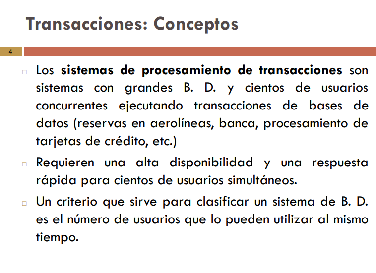
        
        El procesamiento de transacciones en bases de datos se refiere a la **gestión de operaciones que cambian el estado de una base de datos, garantizando que estas operaciones se completen de manera consistente y fiable**. Las transacciones son unidades de trabajo que deben completarse en su totalidad o no se completan, asegurando la integridad de los datos. 
        
        
        
        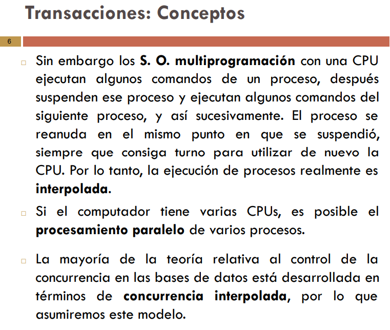
        
        - **Transaccion - Definicion**
            
            
            
            Cada transaccion tiene una memoria local, es decir, trae una copia del dato consultado para trabajar con el, y recien cuando se guarda se pisa con el anterior.
            
            
            
            
            
        - **Concurrencia**
            
            
            
            Cada transaccion tiene una memoria local, es decir, trae una copia del dato consultado para trabajar con el, y recien cuando se guarda se pisa con el anterior.
            
            - **Actualizacion a perdida**
                
                
                
                Cuando dos transacciones que intentan modificar la BD ambas leen datos antiguos y una modifica el dato pero se pierde porque la otra tambien lo hace y la escribe (guarda) sin haberse escrito la primera transaccion. Una forma de controlarlo es que las transacciones tienen que pedir permiso para acceder al recurso compartido
                
            - **Lectura sucia**
                
                
                
                T1 lee A luego que la T2 lo escribio, osea que el valor que lee T1 es un valor que produjo T2. Si hay un problema en T2, la misma no se pudo completar, porque no se pueden hacer por partes las transacciones, deben cumplir las propiedades **ACID**:
                
                - **Atomicidad**: una transaccion no se puede dividir en partes.
                - **Consistencia**: se refiere a que la informacion guardada en la BD es fiel a la realidad.
                - **Aislamiento**: ninguna transaccion debe interferir con otra, se deben ejecutar de manera unica.
                - **Durabilidad**: si una transaccion finaliza bien, los cambios deben perdurar en el tiempo.
            - **Analisis Inconsistente**
                
                
                
                T1 llega a un **análisis inconsistente** porque **lee datos que ya fueron modificados por otra transacción (T2), pero no desde el inicio**, generando así una **mezcla de valores antiguos y nuevos** que no reflejan ningún estado real de la base de datos.
                
            
            
            
        - **¿Por qué es necesaria la recuperación?**
            
            
            
            
            
        - **Estados de ejecución**
            
            
            
            
            
            - Una transacción entra en **estado activo** inmediatamente después de iniciarse su ejecución; en este estado puede emitir operaciones LEER y ESCRIBIR. Cuando la transacción termina, pasa al **estado de parcialmente confirmada**.
            - En ese punto, se necesitan algunos protocolos para comprobar que los cambios de la transacción sean efectivos y una vez que esta comprobación es satisfactoria, se dice que la transacción ha alcanzado su punto de confirmación y entra en el **estado de confirmada**.
            - No obstante, una transacción puede entrar en el **estado de fallo** si falla alguna de las comprobaciones o si la transacción es cancelada durante su estado activo.
            - El **estado terminado** se alcanza cuando la transacción abandona el sistema.
        - **Propiedades ACID**
            
            
            
            **Las transacciones poseen las siguientes propiedades:**
            
            - **Atomicidad**: Una transacción es una unidad atómica de procesamiento; o se ejecuta en su totalidad o no se ejecuta en absoluto.
            - **Conservación de la consistencia**: Una transacción está conservando la consistencia si su ejecución completa lleva a la B. D. de un estado consistente a otro.
            - **Aislamiento (Isolation)**: Una transacción debe aparecer como si estuviera ejecutándose de forma aislada a las demás. Es decir, la ejecución de una transacción no debe interferir con la ejecución de ninguna otra transacción simultánea.
            - **Durabilidad**: Los cambios aplicados a la B. D. por una transacción confirmada deben persistir en la B. D. Estos cambios no deben perderse por culpa de un fallo.
        - **Planificaciones**
            
            
            
            
            
            - **Ejemplo**
                
                
                
                
                
                
                
                
                
            
            
            
            
            
            
            
            - **Ejercicio 1**
                
                **Dos planificaciones son equivalentes por conflicto si el orden de cualquier par de operaciones en conflicto es el mismo en las dos planificaciones.**
                
                
                
                
                
                
                
            - **Ejercicio 2**
                
                
                
            
            
            
            
            
            
            
            
            
            - **Ejercicio 3**
                
                
                
                
                
                
                
                
                
                
                
                
                
            - **Planificaciones en Serie (Secuenciales)**
                
                
                
                
                
            - **Planificaciones serializables**
                
                
                
    - **Transacciones (Control de concurrencia - Bloqueos - Protocolos - Granularidad - Interbloqueos)**
        
        
        
        - **Bloqueos**
            
            
            
            - **Bloqueo Compartido**
                
                
                
            - **Bloqueo Exlusivo**
                
                
                
            
            
            
            
            
            - **Ejemplos**
                
                
                
                
                
                
                
                
                
                
                
                
                
                
                
        - **Protocolos de bloqueo**
            
            
            
            
            
            - **Protocolos de bloqueo de dos fases**
                
                
                
                
                
                
                
                
                
                
                
                
                
                - **Ejercicio 4**
                    
                    
                    
                    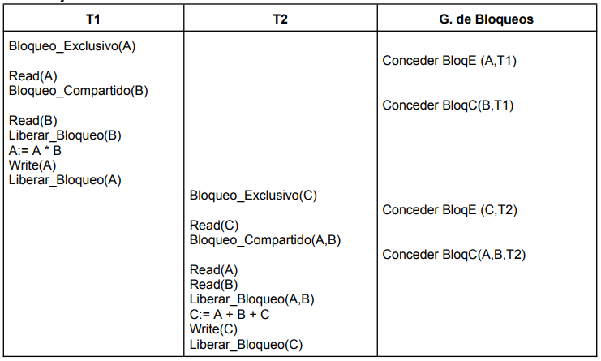
                    
            - **Protocolo basado en marcas temporales**
                
                
                
                
                
                
                
                
                
                
                
                
                
                
                
                
                
                
                
                
                
        - **Granularidad**
            
            
            
            
            
            
            
            
            
            
            
            
            
            
            
            
            
            
            
        - **Interbloqueos**
            
            
            
            - **Prevención de Interbloqueos**
                
                
                
                
                
                
                
            - **Deteccion de Interbloqueos**
                
                
                
                
                
                
                
                
                
            - **Interbloqueos**
                
                
                
    - **Transacciones (Técnicas de recuperación de Bases de Datos)**
        
        
        
        
        
        
        
        
        
        
        
        
        
        
        
        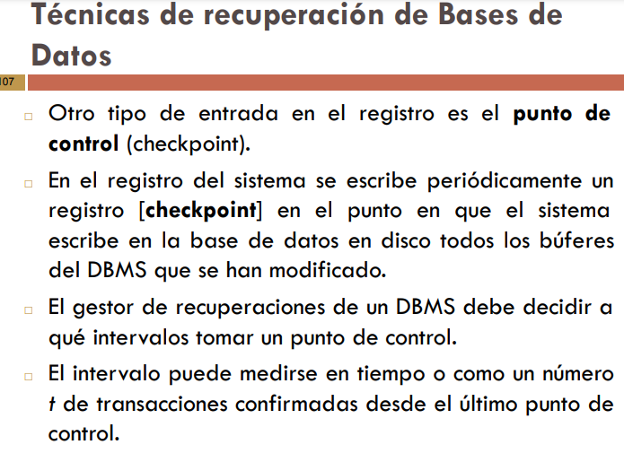
        
        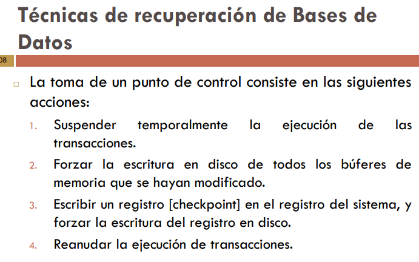
        
        - **Tecnicas de recuperacion basadas en la actualizacion diferida**
            
            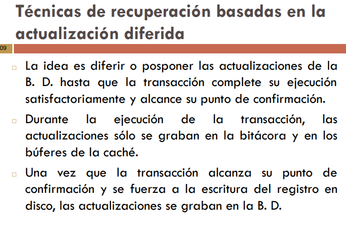
            
            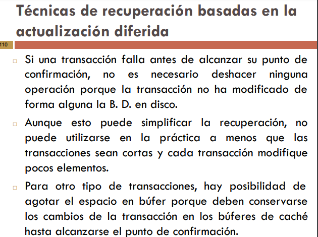
            
            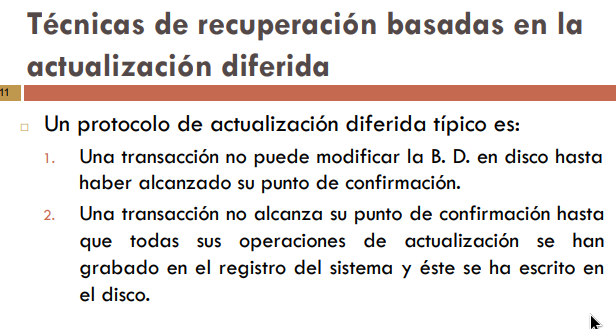
            
        - **Recuperación mediante la actualización diferida en un entorno multiusuario**
        
- **SQL (Structured Query Language)**
    
    [Tips Sobre SQL.pdf](assets/Tips_Sobre_SQL.pdf)
    
    [ClaseSQLC31.sql](assets/ClaseSQLC31.sql)
    
    - **Guia de comandos**
        
        .png)
        

---

- **Trabajos Practicos**
    - **Tp1 (Modelo Entidad Relacion)**
        
        [Bases de Datos 2025 - Trabajo Práctico_ Modelo Entidad Relación.pdf](assets/Bases_de_Datos_2025_-_Trabajo_Prctico__Modelo_Entidad_Relacin.pdf)
        
        - **1) Pequeña empresa**
            
            
            
        - **2) Gabinete de abogados**
            
            Se quiere diseñar una base de datos relacional para almacenar información sobre los asuntos que lleva un gabinete de abogados. Cada asunto tiene un número de expediente que lo identifica, y corresponde a un solo cliente. Del asunto se debe almacenar el período (fecha de inicio y fecha de archivo o finalización), su estado (en trámite, archivado, etc.), así como los datos personales del cliente al que pertenece (DNI, nombre, dirección, etc.). Algunos asuntos son llevados por uno o varios procuradores, de los que nos interesa también los datos personales. Realizar el diagrama de ER
            
            
            
        - **3) Club náutico**
            
            Se quiere diseñar una base de datos relacional para gestionar los datos de los socios de un club náutico. De cada socio se guardan los datos personales y los datos del barco o barcos que posee: número de matrícula, nombre, número del amarre y cuota que paga por el mismo. Además, se quiere mantener información sobre las salidas realizadas por cada barco, como la fecha y hora de salida, el destino y los datos personales del patrón, que no tiene porque ser el propietario del barco, ni es necesario que sea socio del club.
            Realizar el diagrama de ER.
            
            
            
        - **4) Sedes olímpicas**
            
            Las sedes olímpicas se dividen en complejos deportivos. Los complejos deportivos se subdividen en aquellos en los que se desarrolla un único deporte y en los polideportivos. Los complejos polideportivos tienen áreas designadas para cada deporte con un indicador de localización (ejemplo: centro, esquina-NE, etc.). Un complejo tiene una localización, un jefe de organización individual y un área total ocupada.
            
            Los dos tipos de complejos (deporte único y polideportivo) tendrán diferentes tipos de
            información. Para cada tipo de sede, se conservará el número de complejos junto con su presupuesto aproximado.
            
            Cada complejo celebra una serie de eventos (ejemplo: la pista del estadio puede celebrar muchas carreras distintas.). Para cada evento está prevista una fecha, duración, número de participantes, número de comisarios. Una lista de todos los comisarios se conservará junto con la lista de los eventos en los que esté involucrado cada comisario ya sea cumpliendo la tarea de juez u observador. Tanto para cada evento como para el mantenimiento se necesitará cierto equipamiento (ejemplo: arcos, pértigas, barras paralelas, etc).
            
            .png)
            
        - **5) Sistema de control de vuelos**
            
            Obtener el diagrama ER para un sistema de control de vuelos adaptado a las siguientes reglas de gestión (indicar las entidades, interrelaciones, etc., que se deducen de cada una de las reglas):
            a) De cada aeropuerto se conoce su código, nombre, ciudad y país.
            b) En cada aeropuerto pueden tomar tierra diversos modelos de aviones (el modelo de un avión determina su capacidad, es decir, el número de plazas. 
            c) En cada aeropuerto existe una colección de programas de vuelo. En cada programa de vuelo se indica el número de vuelo, línea aérea y días de la semana en que existe dicho vuelo.
            d) Cada programa de vuelo despega de un aeropuerto y aterriza en otro.
            e) Los números de vuelo son únicos para todo el mundo.
            f) En cada aeropuerto hay múltiples aterrizajes y despegues. Todos los aeropuertos
            contemplados están en activo, es decir, tienen algún aterrizaje y algún despegue.
            g) Cada vuelo realizado pertenece a un cierto programa de vuelo. Para cada vuelo se quiere conocer su fecha, plazas vacías y el modelo de avión utilizado.
            h) Algunos programas de vuelo incorporan escalas técnicas intermedias entre los aeropuertos de salida y de llegada. Se entiende por escala técnica a un aterrizaje y despegue consecutivos sin altas ó bajas de pasajeros.
            i) De cada vuelo se quieren conocer las escalas técnicas ordenadas asignándole a cada una un número de orden. 
            Por ejemplo, el programa de vuelo 555 de Iberia con vuelos los lunes y jueves despega de Barajas-Madrid-España y aterriza en Caudell-Sydney-Australia teniendo las siguientes escalas técnicas: 1- Los Pradiños-Sao Paulo-Brasil, 2-El Emperador-Santiago-Chile y 3-Saint Kitts-Auckland-Nueva Zelanda.
            ¿Qué cambios se producirán en el caso anterior si en las escalas pudiesen bajar o subir
            pasajeros?
            Explicar cómo se podría representar esta nueva situación. → se necesitaria poner una nueva entidad y relacion
            
            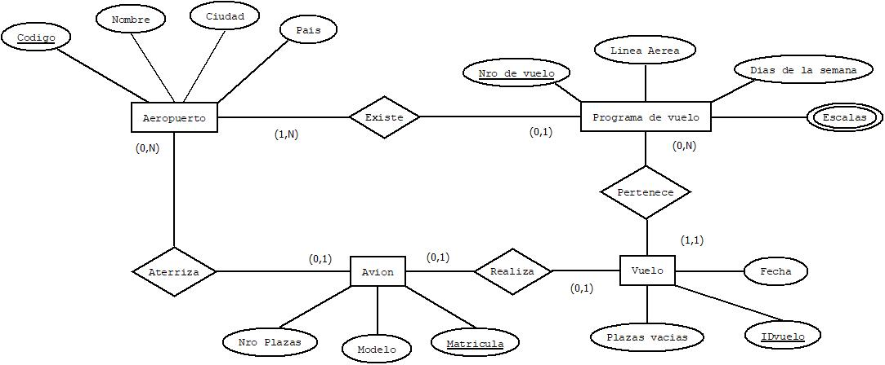
            
        - **6) Cadena editorial**
            
            Realizar el diagrama de ER para una cadena editorial con los siguientes supuestos:
            
            1. La cadena tiene varias sucursales con su nombre, su dirección, población, teléfono y código postal
            2. La editorial tiene trabajadores que son empleados de sucursales o periodistas.
            3. De los trabajadores tendremos sus datos personales: DNI, nombre, domicilio, población, teléfono, email
            4. Cada sucursal tiene varios empleados.
            5. Un empleado trabaja en una única sucursal y tiene un salario mensual.
            6. En cada sucursal se publican varias revistas. Cada revista se edita en una sucursal.
            7. Para cada revista guardaremos su código, nombre de la revista, fecha de fundación, director, periodicidad (semanal, trimestral,...), tipo (información general, deportivas, rosa,...).
            8. La cadena editorial tiene periodistas (que no trabajan en sucursales) que pueden escribir artículos para varias revistas, guardaremos el tema del artículo , la extensión del artículo y la fecha en la que lo escribió. De los periodistas guardaremos los mismos datos que para los empleados, añadiendo su especialidad.
            9. Almacenaremos también las secciones fijas de cada revista, que tendrán un título y una extensión (no todas las revistas tienen las mismas secciones fijas).
            10. De los ejemplares editados por una revista guardaremos: número de la edición (para cada vez que sale la revista), fecha edición, número de páginas y el número de ejemplares vendidos.
                
                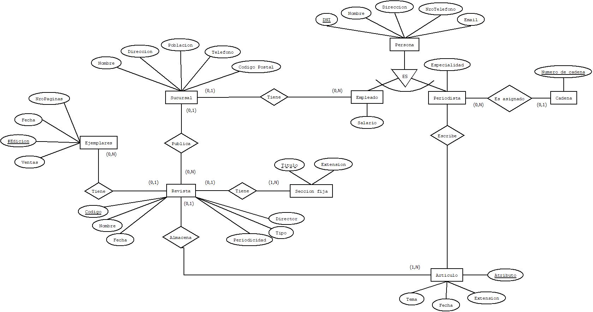
                
        - **7) Pedidos de viajen en remis**
            
            Se desea modelar, usando el diagrama ER, información para el manejo de pedidos de viajes en remis por parte de los empleados de diferentes instituciones.
            Es necesario guardar información acerca de las instituciones, de cada institución se registra nombre (único), domicilio completo y teléfonos. Cada institución está formada por oficinas en las cuales trabajan empleados, quienes pueden solicitar remises a la agencia que trabaja con la institución. Una agencia puede trabajar con una única institución y en cada institución se trabaja con una sola agencia, pero es común que una institución cambie de agencia a lo largo del tiempo. Cualquier empleado de las diferentes oficinas puede pedir un remis a la agencia, pero el viaje solicitado debe ser autorizado por un empleado jerárquico.
            Las oficinas se caracterizan por tener un nombre, el cual puede repetirse en diferentes
            instituciones, pero no dentro de la misma institución. También poseen un número de interno y piso donde se encuentra.
            De cada empleado se conoce un número de empleado, nombre, apellido, dni, a qué oficina pertenece y si puede autorizar viajes o no. Es importante que quede registrado qué empleado solicitó el viaje y qué empleado lo autorizó en caso de que esto ocurra.
            Se sabe que nuestro modelo deberá responder a las siguientes solicitudes:
            
            - Conocer la cantidad de viajes que pidió cada empleado.
            - Conocer la oficina que más gasta en viajes.
            - El destino y el origen del viaje más caro.
            - Fecha y hora de los viajes de un año determinado.
            - El empleado jerárquico que autorizó más viajes.
            - Agencias que trabajaron a lo largo del tiempo con una institución determinada y entre qué fechas lo hicieron.
            - Conocer la dirección, nombre, teléfono y código de una agencia determinada.
                
                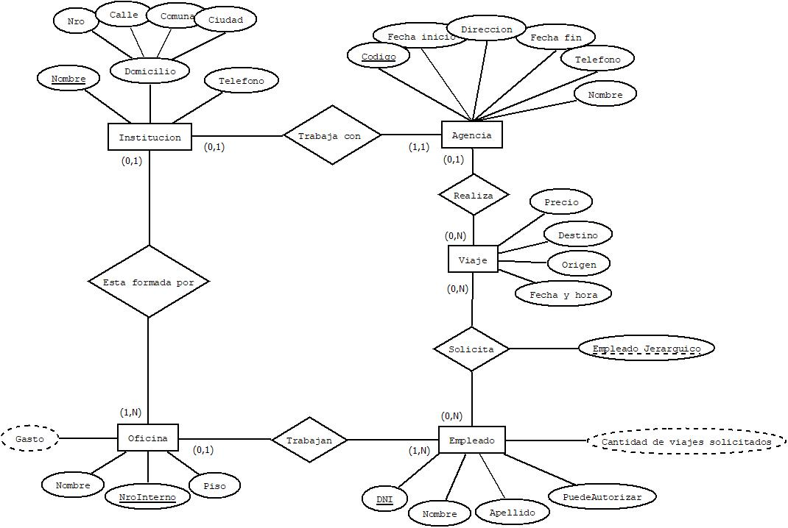
                
    - **Tp2 (Modelo Relacional)**
        
        [Bases de Datos 2025 - Trabajo Práctico_ Modelo Relacional.pdf](assets/Bases_de_Datos_2025_-_Trabajo_Prctico__Modelo_Relacional.pdf)
        
        - **1) Biblioteca**
            
            
            
            Libro = (ISBN, año, titulo, idioma).
            
            Autor = (Nombre).
            
            Copia = (Numero, ISBN).
            
            Copia_Prestada_Usuario = (Numero, id, ISBN, Fecha_devolucion, Fecha_prestamo).
            
            Usuario = (id, nombre).
            
            Libro_Autor = (nombre, ISBN).
            
            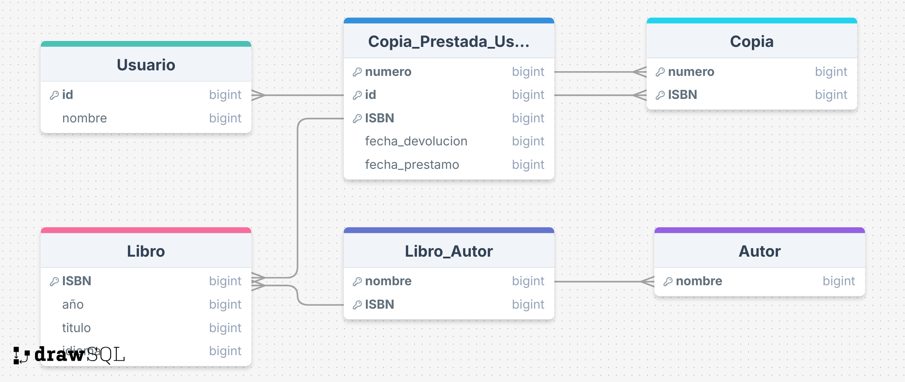
            
        - **2) Farmacias**
            
            
        - **3) AXB**
            
            
            
            A = (A1, A21, A22)
            
            B = (B1, B3)
            
            B2 = (B1, B2A) → multivalorado se hace una nueva tabla
            
            C = (A1, C1, C2) → se pone la clave primaria porque hay una relacion 1…1
            
            BC = (B1, C1)
            
            ABx = (AB, A1, B1)
            
            B2x = (B1,B2)
            
            .png)
            
        
        **Convertir los diagramas de ER obtenidos en la práctica anterior en modelos relacionales**
        
        - **1) Pequeña empresa**
            
            
            
            Cliente =(#Cliente, Saldo, Limite de Credito, Descuento)
            
            Direcciones de Envio = (#Cliente, N**º**, Calle, Comuna, Ciudad)
            
            Pedido = (#Cliente, Fecha, N**º**, Calle, Comuna, Ciudad)
            
            Pedido_Articulo = (#Articulo, #Cliente, Fecha, Cantidad)
            
            Articulo = (#Articulo, Descripcion)
            
            Articulo_Fabrica = (#Articulo, #Fabrica, Existencias)
            
            Fabrica = (#Fabrica, Telefono, N**º** Articulos provistos)
            
            .png)
            
        - **2) Gabinete de abogados**
            
            
            
            Persona = (DNI, Nombre, Direccion)
            
            Cliente = (DNI, #Cliente)
            
            Procurador = (DNI, Legajo)
            
            Asunto = (#Expediente, Fecha_fin, Fecha_inicio, Estado)
            
            Procurador_lleva_Asunto = (#Expediente, Legajo)
            
            .png)
            
        - **3) Club náutico**
            
            
            
            Persona = (DNI, Nombre)
            
            Socio = (DNI, #Socio)
            
            Patron = (DNI, #Patron)
            
            Barco = (Matricula, Amarre, Nombre,  Cuota)
            
            Salida = (Fecha, Hora, #Salida)
            
        - **4) Sedes olímpicas**
        - **5) Sistema de control de vuelos**
            
            
            
            Aeropuerto = (Codigo, Nombre, Ciudad, Pais)
            
            Avion = (Matricula, Modelo, Nro Plazas)
            
            Vuelo = (IDvuelo, Fecha, Plazas Vacias)
            
            Programa de vuelo = (Nro de vuelo, Linea Aerea, Dias de la semana)
            
            Escala = (Nro de vuelo, nombre)
            
        - **6) Cadena editorial**
            
            
            
    - **Tp3 (Algebra Relacional)**
        
        [Bases de Datos 2025 - Trabajo Práctico_ Álgebra Relacional.pdf](assets/Bases_de_Datos_2025_-_Trabajo_Prctico__lgebra_Relacional.pdf)
        
        **Dadas las siguientes relaciones, resolver utilizando Álgebra Relacional las consultas planteadas.**
        
        - **Ejercicio 1**
            
            
            
            .png)
            
        - **Ejercicio 2**
            
            
            
            .png)
            
        - **Ejercicio 3**
            
            
            
            - **Ejercicio 1**
                
                tandil ← $π_{codInmueble}$(**$σ_{localidad = tandil}(inmuebles)$**)
                
                prop ← $π_{propinmueble.cuil}$(tandil ⨝ ****Propinmueble)
                
                p ← $π_{propietarios.dni}$(prop ⨝ ****propietarios)
                
                $π_{apellido, nombre}$(p ⨝ personas)
                
            - **Ejercicio 2**
                
                contrat ←$π_{dni}$$(σ_{fechaActual > fechaVtoContra}(contratos))$
                
                $π_{nombre, apellido}$(Personas ⨝ contrat)
                
            - **Ejercicio 3**
        _**_**__         
                C ←$π_{codInmueble}$ $(σ_{fechaIncioAlquiler > 01/03/2025}(Contratos))$
                
                $π_{cuil}$(C ⨝ PropInmueble)
                
            - **Ejercicio 4**
                
                p ← $π_{propietarios.dni}$(PropInmueble ⨝ ****propietarios)
                
                $π_{Personas.Nombre, Peronas.Apellido}$(Personas ⨝ ****P)
                
            - **Ejercicio 5**
                
                CodEliminar ← $π_{contratos.codInmueble}$(($σ_{fechaVtoContra > fechaActual}$(Contratos))
                
                In ← $π_{inmuebles.codInmueble}$(Inmuebles) - CodEliminar
                
                C ← $π_{PropInmueble.cuil}$(In ⨝ PropInmueble)
                
                P ← $π_{propietarios.dni, propietarios.cuil}$(Propietarios ⨝ C)
                
                $π_{Personas.dni, Personas.cuil, Personas.nombre, Personas.apellido}$(P ⨝ Personas)
                
            - **Ejercicio 6**
                
                $π_{nroContrato}$($σ_{fechaVtoContra > 31/05/2026}$(Contratos))
                
            - **Ejercicio 13**
                
                InmueblesPropietario ← $π_{codInmueble}$($σ_{cuil = 111111}$ (Propinmueble))
                
                Contratos ← Contratos – (Contratos ⨝ InmueblesPropietario)
                
                Inmuebles ← Inmuebles - (Inmuebles ⨝ InmueblesPropietario)
                
                PropInmuebles ← PropInmuebles - ($σ_{cuil = 111111}$ (Propinmueble))
                
                Propietarios ← Propietarios - $σ_{cuil = 111111}$(Propietarios)
                
            - **Ejercicio 14**
                
                Loc ← $π_{Localidad}$($σ_{cuil = 654321}$(Propietarios))
                
                Dir ←  $π_{Localidad}$($σ_{cuil = 654321}$(Propietarios))
                
                PropietarioMod ←  $σ_{cuil = 123456}$(Propietarios)
                
                Propietarios ← Propietarios - PropietarioMod
                
                $∂_{Localidad=loc and Direccion=Dir}$(PropietarioMod)
                
                Propietarios ← Propietarios U PropietarioMod
                
    - **TP4 (Normalizacion)**
        
        [Base de Datos 2025 - Trabajo práctico_Normalización.pdf](assets/Base_de_Datos_2025_-_Trabajo_prctico_Normalizacin.pdf)
        
        - **Ejercicio 1**
            
            
            
        - **Ejercicio 2**
            
          _**_**__   
            
        - **Ejercicio 3**
            
            
            
        - **Ejercicio 4**
            
            
            
        - **Ejercicio 5**
            
            
            
        - **Ejercicio 6**
            
            
            
        - **Ejercicio 7**
            
            
            
        - **Ejercicio 8**
            
            
            
        - **Ejercicio 9**
            
            
            
        - **Ejercicio 10**
            
            
            
        - **Ejercicio 11**
            
            
            
        - **Ejercicio 12**
            
            
            
        - **Ejercicio 13**
            
            
        - **Ejercicio 14**
            
            
    - **Tp5 (Transacciones)**
        
        [Bases de Datos 2025 - Trabajo Práctico_ Transacciones.pdf](assets/Bases_de_Datos_2025_-_Trabajo_Prctico__Transacciones.pdf)
        
        - **Ejercicio 1**
            
            
            
            Estos son los **estados** por los que puede pasar una transaccion:
            
            
            
            - Una transacción entra en **estado activo** inmediatamente después de iniciarse su ejecución; en este estado puede emitir operaciones **LEER** y **ESCRIBIR**. Cuando la transacción termina, pasa al **estado de parcialmente confirmada**.
            - En ese punto, se necesitan algunos protocolos para comprobar que los cambios de la transacción sean efectivos y una vez que esta comprobación es satisfactoria, se dice que la transacción ha alcanzado su punto de confirmación y entra en el **estado de confirmada**.
            - No obstante, una transacción puede entrar en el **estado de fallo** si falla alguna de las comprobaciones o si la transacción es cancelada durante su estado activo.
            - El **estado terminado** se alcanza cuando la transacción abandona el sistema.
        - **Ejercicio 2**
            
            
            
            Los tres problemas de concurrencia que pueden surgir al momento de acceder a los datos son:
            
            - **Actualizacion a perdida**
                
                
                
            - **Lectura sucia**
                
                
                
            - **Analisis Inconsistente**
                
                
                
            
        - **Ejercicio 3**
            
            
            
        - **Ejercicio 4**
            
            
            
            Planificacion 1:
            
            
            
            
            
            La planificacion 1 es serializable por conflicto ya que no contiene ciclos.
            
            Planificacion 2:
            
            
            
            
            
            La planificacion 2 es serializable por conflicto ya que no contiene ciclos.
            
            Planificacion 3:
            
            
            
            
            
            La planificacion 3 no es serializable por conflicto ya que contiene ciclos.
            
        - **Ejercicio 5**
            
            
            
            1. Los posibles resultados con la ejecucion en serie de estas transacciones son 2!=2, ya que la cantidad de transacciones posibles son *n!*
            2. 
        - **Ejercicio 6**
            
            
            
            Los posibles resultados con la ejecucion en serie de estas transacciones son 3!=6, ya que la cantidad de transacciones posibles son *n!*, sin embargo los resultados correctos son 3, ya que los otros 3 son iguales.
            
            
            
            
            
            
            
        - **Ejercicio 7**
            
            
            
        - **Ejercicio 8**
            
            
            
            
            
            
            
        - **Ejercicio 9**
            
            
            
        - **Ejercicio 10**
            
            
            
            
            
        - **Ejercicio 11**
            
            
            
            
            
            **La planificación NO cumple con el protocolo de bloqueo de dos fases**, porque la transacción (T1) **libera bloqueos antes de terminar de adquirirlos**, violando la fase de crecimiento del protocolo.
            
        - **Ejercicio 12**
            
            
            
            a.
            
            
            
            b.
            
        - **Ejercicio 13**
            
            
            
        - **Ejercicio 14**
            
            
            
    - **TP’s SQL**
        - **TP1 - SQL Creación y Generación de Información**
            
            [Trabajo práctico  - Trabajo Práctico_SQL 1.pdf](assets/Trabajo_prctico__-_Trabajo_Prctico_SQL_1.pdf)
            
            - **Ejercicio 1**
                
                
                
                
                
            - **Ejercicio 2**
                
                
                
                
                
                En **SQL Server**, `UNIQUEIDENTIFIER` es un tipo de dato que almacena un **GUID** (Globally Unique Identifier), es decir, un **identificador único global**. Tiene una longitud fija de **16 bytes** (128 bits).
                
                
                
                
                
                
                
                
                
                
                
                
                
                
                
                
                
                Se le agrega **`DEFAULT NEWID()`** para que se asigne automaticamente.
                
            - **Ejercicio 3**
                
                
                
                ```sql
                USE ventas_e;
                
                -- Eliminar la columna 'Usuario' de la tabla
                ALTER TABLE Usuario
                DROP COLUMN Usuario;
                
                -- Agregar un nuevo campo que sea email (varchar(70))
                ALTER TABLE Usuario
                ADD Email VARCHAR(70);
                
                /* Agregar los campos Domicilio (varchar(150)) y Telefono (varcvhar(30)) en la tabla Usuario.
                Luego, agregar los mismos campos a la tabla Empresa. */
                
                ALTER TABLE Usuario
                ADD Domicilio VARCHAR(150);
                ALTER TABLE Usuario
                ADD Telefono VARCHAR(30);
                
                ALTER TABLE Empresa
                ADD Domicilio VARCHAR(150);
                ALTER TABLE Empresa
                ADD Telefono VARCHAR(30);
                ```
                
                [Ejercicio3_1.sql](assets/Ejercicio3_1.sql)
                
            - **Ejercicio 4**
                
                
                
                
                
                ```sql
                USE ventas_e;
                
                -- Agrego la columna Dominio a la tabla 'Empresa'
                ALTER TABLE Empresa
                ADD Dominio VARCHAR(50);
                
                -- Inserto datos a Empresa
                INSERT INTO Empresa (RazonSocial, CUIT, Domicilio, Telefono, Dominio) 
                VALUES ('ALBOCAR', '20-24563524-1', '536 nro. 67', '0221 455-8523', 'Albocar');
                INSERT INTO Empresa (RazonSocial, CUIT, Domicilio, Telefono, Dominio) 
                VALUES ('AUTOCLIPS VAER SA', '30-56225853-4', 'Ate. Brown 876', '011 4457-7778', 'Vaersa');
                INSERT INTO Empresa (RazonSocial, CUIT, Domicilio, Telefono, Dominio) 
                VALUES ('GOICOECHEA', '30-57788523-5', 'Pte. Perón 4521', '0224 4522-3652', 'Goicoechea');
                INSERT INTO Empresa (RazonSocial, CUIT, Domicilio, Telefono, Dominio) 
                VALUES ('CGO', '27-24246552-2', '46 Nro. 1587', '0221 412-5623', 'Districgo');
                INSERT INTO Empresa (RazonSocial, CUIT, Domicilio, Telefono, Dominio) 
                VALUES ('BELPE', '30-45235689-7', '122 Nro. 4201', '0221 423-2323', 'Belpe');
                INSERT INTO Empresa (RazonSocial, CUIT, Domicilio, Telefono, Dominio) 
                VALUES ('DISTRIFERR', '20-58545565-1', 'Moreau Nro. 524', '0229 45-5623', 'Distriferr');
                INSERT INTO Empresa (RazonSocial, CUIT, Domicilio, Telefono, Dominio) 
                VALUES ('AZ MOTOR', '30-44215532-5', '44 Esq. 200 Nro. 4522', '0221 452-5262', 'Azmotor');
                
                ```
                
                [Ejercicio4_1.sql](assets/Ejercicio4_1.sql)
                
            - **Ejercicio 5**
                
                
                
                **Primero ingreso los datos necesarios para resolver el ejercicio:**
                
                ```sql
                USE ventas_e;
                
                Select * from usuario
                
                -- INSERTAR USUARIOS
                INSERT INTO Usuario (Token, AyN, Usuario, Password)
                VALUES
                (NEWID(), 'Lionel Galo', 'lgalo', 'pass123'),
                (NEWID(), 'Maximiliano Gonzalez', 'mgonzalez', 'maxi123'),
                (NEWID(), 'Carlos Gómez', 'cgomez', 'gomez321'),
                (NEWID(), 'Ana Torres', 'atorres', 'ana456'),
                (NEWID(), 'Luis Goicoechea', 'lgoico', 'goico789');
                
                -- RELACIONES INICIALES (UsuarioXEmpresa)
                INSERT INTO UsuarioXEmpresa (Token, IdEmpresa)
                VALUES
                -- Lionel Galo → ALBOCAR (Id 2)
                ((SELECT Token FROM Usuario WHERE AyN = 'Lionel Galo'), 2),
                
                -- Maximiliano Gonzalez → ALBOCAR (Id 2)
                ((SELECT Token FROM Usuario WHERE AyN = 'Maximiliano Gonzalez'), 2),
                
                -- Carlos Gómez → AZ MOTOR (Id 7)
                ((SELECT Token FROM Usuario WHERE AyN = 'Carlos Gómez'), 7),
                
                -- Ana Torres → GOICOECHEA (Id 4)
                ((SELECT Token FROM Usuario WHERE AyN = 'Ana Torres'), 4),
                
                -- Luis Goicoechea → GOICOECHEA (Id 4)
                ((SELECT Token FROM Usuario WHERE AyN = 'Luis Goicoechea'), 4);
                
                ```
                
            - **Ejercicio 6**
                
                
                
                ```sql
                USE ventas_e;
                
                SELECT * from Usuario
                SELECT * from Empresa
                SELECT * from UsuarioXEmpresa
                
                -- Lionel Galo abandonó la Empresa en la que trabajaba, y fue contratado por CGO
                DELETE FROM UsuarioXEmpresa
                WHERE Token = (SELECT Token FROM Usuario WHERE AyN = 'Lionel Galo');
                
                INSERT INTO UsuarioXEmpresa (Token, IdEmpresa)
                VALUES ((SELECT Token FROM Usuario WHERE AyN = 'Lionel Galo'), 5);
                
                /* Maximiliano Gonzalez, fue enrolado en el ejército por lo que pidió la baja de la Empresa
                Albocar en la que trabajaba hasta su regreso. */DELETE FROM UsuarioXEmpresaWHERE Token = (SELECT Token FROM Usuario WHERE AyN = 'Maximiliano Gonzalez')-- Entonces luego, la empresa Albocar, adquirió la empresa Az Motor, y todos sus empleados.INSERT INTO UsuarioXEmpresa (Token, IdEmpresa)
                SELECT Token, 
                       (SELECT IdEmpresa FROM Empresa WHERE RazonSocial = 'ALBOCAR')
                FROM UsuarioXEmpresa
                WHERE IdEmpresa = (SELECT IdEmpresa FROM Empresa WHERE RazonSocial = 'AZ MOTOR');
                
                DELETE FROM UsuarioXEmpresa
                WHERE IdEmpresa = (SELECT IdEmpresa FROM Empresa WHERE RazonSocial = 'AZ MOTOR');
                ```
                
        - **TP2 - Diagramación y consultas SQL**
            
            [Trabajo práctico - Trabajo Práctico_SQL 2.pdf](assets/Trabajo_prctico_-_Trabajo_Prctico_SQL_2.pdf)
            
            [TP2.sql](assets/TP2.sql)
            
            
            
            - **Query para crear la base de datos para la practica**
                
                
            
            
            
            ```sql
            SELECT * FROM Cliente;
            ```
            
            
            
            ```sql
            SELECT Apellido, Nombre
            FROM Cliente
            ORDER BY Apellido DESC;
            ```
            
            
            
            ```sql
            SELECT IDTipoIva, COUNT(*) AS CantidadCliente
            FROM Cliente
            GROUP BY IDTipoIVA;
            ```
            
            
            
            ```sql
            SELECT * FROM Cliente WHERE Apellido = 'Martinez'
            ```
            
            
            
            ```sql
            SELECT C.RazonSocial, COUNT(C.Token) AS Cantidad
            FROM Cliente C
            GROUP BY C.RazonSocial
            HAVING COUNT(C.Token) > 1;
            ```
            
            
            
            ```sql
            SELECT A.Descripcion, COUNT(IV.idVenta) AS CantVecesVendida
            FROM Venta V
            JOIN ItemVenta IV ON V.idVenta = IV.idVenta
            JOIN Articulo A ON IV.idArticulo = A.idArticulo
            WHERE YEAR(V.Fecha) = 2018
            GROUP BY A.Descripcion;
            ```
            
            
            
            ```sql
            SELECT RazonSocial, DNI 
            FROM Cliente
            WHERE CUIT IS NULL
            ORDER BY DNI ASC;
            ```
            
            
            
            ```sql
            SELECT * FROM Cliente
            WHERE IDTipoIva = (SELECT IDTipoIva FROM TipoDeIva WHERE Descripcion = 'Resp. Inscripto')
            AND (CUIT IS NULL OR CUIT = '');
            ```
            
            
            
            ```sql
            SELECT 
                A.codigo,
                A.Descripcion, 
                AVG(IV.cantidad) AS promedio
            FROM Venta V 
            JOIN ItemVenta IV ON V.idVenta = IV.idVenta 
            JOIN Articulo A ON IV.idArticulo = A.idArticulo
            GROUP BY A.codigo, A.Descripcion
            ORDER BY promedio DESC;
            ```
            
            
            
            ```sql
            SELECT 
                E.RazonSocial,
                S.NombreSeccion,
                COUNT(A.idArticulo) AS CantidadArticulos
            FROM Seccion S
            JOIN Empresa E ON S.idEmpresa = E.idEmpresa
            JOIN Rubro R ON R.idSeccion = S.idSeccion
            JOIN Articulo A ON A.idRubro = R.idRubro
            GROUP BY E.RazonSocial, S.NombreSeccion
            ORDER BY E.RazonSocial, S.NombreSeccion;
            ```
            
            
            
            ```sql
            SELECT 
                E.RazonSocial, 
                SUM(IV.Cantidad * IV.Precio) AS MontoVendido
            FROM Empresa E
            JOIN Seccion S ON E.idEmpresa = S.idEmpresa
            JOIN Rubro R ON S.idSeccion = R.idSeccion
            JOIN Articulo A ON R.idRubro = A.idRubro
            JOIN ItemVenta IV ON A.idArticulo = IV.idArticulo
            JOIN Venta V ON V.idVenta = IV.idVenta
            WHERE YEAR(V.Fecha) = YEAR(GETDATE())
            GROUP BY E.RazonSocial
            ORDER BY E.RazonSocial;
            ```
            
            
            
            ```sql
            SELECT Descripcion, Precio FROM Articulo WHERE Descripcion LIKE '%unipolar%';
            ```
            
            
            
            ```sql
            SELECT 
                E.RazonSocial AS Empresa,
                A.Descripcion AS Articulo,
                A.Precio
            FROM Empresa E
            JOIN Seccion S ON E.idEmpresa = S.idEmpresa
            JOIN Rubro R ON S.idSeccion = R.idSeccion
            JOIN Articulo A ON R.idRubro = A.idRubro
            ORDER BY E.RazonSocial, A.Descripcion;
            ```
            
            
            
            ```sql
            SELECT U.AyN, COUNT(*) AS UsuariosRegistrados
            FROM Usuario U
            JOIN UsuarioXEmpresa UXE ON U.UserToken = UXE.UserToken
            JOIN Empresa E ON UXE.idEmpresa = E.idEmpresa
            
            GROUP BY U.AyN
            HAVING COUNT(DISTINCT UXE.idEmpresa) > 1
            ```
            
            
            
            ```sql
            SELECT A.idArticulo, A.Descripcion
            INTO ArticulosNoVendidos
            FROM Articulo A
            WHERE A.idArticulo NOT IN (
                SELECT IV.idArticulo FROM ItemVenta IV
            );
            
            SELECT COUNT(*) AS CantidadArticulosNoVendidos
            FROM ArticulosNoVendidos;
            ```
            
            
            
            ```sql
            SELECT 
                E.RazonSocial, 
                MONTH(V.Fecha) AS Mes,
                SUM(IV.Cantidad * IV.Precio) AS MontoPorMes
            FROM Empresa E
            JOIN Seccion S ON E.idEmpresa = S.idEmpresa
            JOIN Rubro R ON S.idSeccion = R.idSeccion
            JOIN Articulo A ON R.idRubro = A.idRubro
            JOIN ItemVenta IV ON A.idArticulo = IV.idArticulo
            JOIN Venta V ON V.idVenta = IV.idVenta
            WHERE YEAR(V.Fecha) = 2019
            GROUP BY E.RazonSocial, MONTH(V.Fecha)
            ORDER BY E.RazonSocial, Mes;
            ```
            
            
            
            ```sql
            SELECT 
                DATEPART(WEEKDAY, Fecha) AS NumeroDiaSemana,
                DATENAME(WEEKDAY, Fecha) AS NombreDiaSemana,
                COUNT(*) AS VentasRealizadasPorDia
            FROM Venta
            GROUP BY DATEPART(WEEKDAY, Fecha), DATENAME(WEEKDAY, Fecha)
            ORDER BY NumeroDiaSemana;
            
            -- FULL GEPETO ESTE
            ```
            
        - **TP3 - Stored Procedures (SP)**
            
            [Trabajo Práctico - Trabajo Práctico_SQL 3.pdf](assets/Trabajo_Prctico_-_Trabajo_Prctico_SQL_3.pdf)
            
            [TP3.sql](assets/TP3.sql)
            
            
            
            ```sql
            CREATE PROCEDURE SP_CantidadVendida
                @Articulo int,
                @Fecha1 date,
                @Fecha2 date
            AS
            BEGIN
                SELECT COUNT(*) AS CantidadVendida
                FROM Articulo A
                JOIN ItemVenta IV ON A.idArticulo = IV.idArticulo
                JOIN Venta V ON IV.idVenta = V.idVenta
                WHERE A.idArticulo = @Articulo
                  AND V.Fecha BETWEEN @Fecha1 AND @Fecha2;
            END;
            ```
            
            
            
            ```sql
            CREATE PROCEDURE SP_ListadoClientes
                @Mes int,
                @Anio int
            AS
            BEGIN
                IF EXISTS (
                    SELECT 1
                    FROM Venta V
                    WHERE MONTH(V.Fecha) = @Mes AND YEAR(V.Fecha) = @Anio
                )
                BEGIN
                    SELECT DISTINCT C.*
                    FROM Cliente C
                    JOIN Venta V ON C.Token = V.Token
                    WHERE MONTH(V.Fecha) = @Mes AND YEAR(V.Fecha) = @Anio;
                END
                ELSE
                BEGIN
                    SELECT 'SIN CLIENTES' AS Mensaje;
                END;
            END;
            
            ```
            
            
            
            ```sql
            CREATE PROCEDURE SP_ListarMontoClientes
                @Año int
            AS
            BEGIN
                SELECT 
                    C.Token,
                    C.RazonSocial,
                    SUM(IV.Cantidad * IV.Precio) AS TotalComprado
                FROM Cliente C
                JOIN Venta V ON C.Token = V.Token
                JOIN ItemVenta IV ON V.idVenta = IV.idVenta
                WHERE YEAR(V.Fecha) = @Año
                GROUP BY C.Token, C.RazonSocial
                HAVING SUM(IV.Cantidad * IV.Precio) > 500000;
            END;
            
            ```
            
            
            
            ```sql
            ALTER TABLE Articulo
            ADD Imagen VARBINARY(MAX)
            
            CREATE PROCEDURE SP_AgregarImagenProducto
            	@img VARBINARY(MAX),
            	@idArticulo int
            AS
            BEGIN
                IF NOT EXISTS (SELECT 1 FROM Articulo WHERE idArticulo = @idArticulo)
                BEGIN
                    RAISERROR('El artículo no existe.', 16, 1);
                    RETURN;
                END
            
                UPDATE Articulo
                SET Imagen = @img
                WHERE idArticulo = @idArticulo;
            
            	SELECT COUNT(A.Imagen) AS CantidadFotos
            	FROM Articulo A
            	WHERE A.idArticulo = @idArticulo;
            END;
            ```
            
            
            
            ```sql
            CREATE PROCEDURE SP_SeccionesSinRubro
            AS
            BEGIN
            	SELECT * FROM Seccion S
            	WHERE S.idSeccion NOT IN (SELECT R.idSeccion FROM Rubro R);
            END;
            ```
            
            
            
            ```sql
            CREATE PROCEDURE SP_RankingClientes
            AS
            BEGIN
            	SELECT 
            		C.RazonSocial AS Nombre_y_Apellido, 
            		C.DNI, 
            		C.Domicilio, 
            		COUNT(V.idVenta) AS CantidadCompras 
            	FROM Cliente C
            	JOIN Venta V ON C.Token = V.Token
            	GROUP BY C.RazonSocial, C.DNI, C.Domicilio
            	ORDER BY CantidadCompras DESC;
            END;
            ```
            
            
            
            ```sql
            CREATE PROCEDURE SP_BuenosClientes
            	@monto int
            AS
            BEGIN
            	SELECT 
            		C.RazonSocial AS Nombre_y_Apellido, 
            		C.DNI,
            		V.idVenta
            	FROM Cliente C
            	JOIN Venta V ON C.Token = V.Token
            	JOIN ItemVenta IV ON V.idVenta = IV.idVenta
            	GROUP BY C.RazonSocial, C.DNI, V.idVenta
            	HAVING SUM(IV.Cantidad*IV.Precio) > @monto;
            END;
            
            ```
            
- **Proyecto**
    - **Entrega 1 (Fase 1 y 2)**
        
        [Entrega 1 - grupo 10 - Joaquin Montes, Pedro Fiuza, Maximo Carpignano (3).pdf](assets/Entrega_1_-_grupo_10_-_Joaquin_Montes_Pedro_Fiuza_Maximo_Carpignano_(3).pdf)
        
        [Reentrega 1 - grupo 10 - Joaquin Montes, Pedro Fiuza, Maximo Carpignano (2) (2).pdf](assets/Reentrega_1_-_grupo_10_-_Joaquin_Montes_Pedro_Fiuza_Maximo_Carpignano_(2)_(2).pdf)
        
    - **Entrega 2 (Fase 3, 4 y 5)**
        
        [Entrega 2 - grupo 10 - Joaquin Montes, Pedro Fiuza, Maximo Carpignano.pdf](assets/Entrega_2_-_grupo_10_-_Joaquin_Montes_Pedro_Fiuza_Maximo_Carpignano.pdf)
        
        [Presentación Grupo 10 Entrega 2.pptx](assets/Presentacin_Grupo_10_Entrega_2.pptx)
        
    - **Entrega 3 (Fase 6 y 7)**
        
        [Entrega 3 - Grupo 10 - Comision S31.pdf](assets/Entrega_3_-_Grupo_10_-_Comision_S31.pdf)
        
        [Entrega 3 (1).sql](assets/Entrega_3_(1).sql)
        
    - **Integrantes**
        - **Joaquin Mones - 33459**
        - **Pedro Fiuza - 33142**
        - **Maximo Carpignano - 32971**

---

**Link Drive**: [https://drive.google.com/drive/folders/1aDWIgEzHrZhI3O9pzaD10qo-A6jFnpe3](https://drive.google.com/drive/folders/1aDWIgEzHrZhI3O9pzaD10qo-A6jFnpe3)

**Para practicar SQL:** [https://datalemur.com/](https://datalemur.com/)
